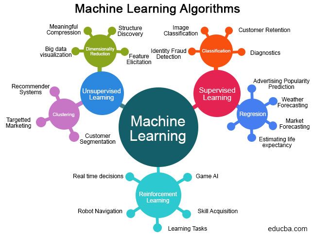

# Introduction Générale à l'Apprentissage Automatique

Nous parlerons de:

- Apprentissage Supervisé
- Apprentissage Non-Supervisé
- Les méthodes à noyaux (Kernel methods)
- Apprentissage par Renforcement

Motivations et les applications pour chaque type d'apprentissage.

## C'est quoi Apprentissage Automatique?

Fig. [1.1].

:width:`500px`
:label:`type_ai`

## Convention Mathématiques pour le document

- Les matrices seront notées en lettre **majuscule** et seront mises en **gras**. Par exemple,

  $\mathbf{X}$

- Les vecteurs seront notés en lettre **miniscule** et mises en **gras**. Par exemple,

  $\mathbf{x}$.

- Lécriture mathématique de probabilités, espérance seront respectivement:

  $\mathbb{P}$, $\mathbb{E}$

- Il sera aussi important de ponctuer les équations.

- Numéroter les équations principales.

- Tous les ensemble seront notés en utilisant

  $\mathbb{R}$

  par example.

- les expressions mathématiques qui sont écrites à travers les textes
  seront écrites dans

  $\operatorname{Prob}$

- Si c'est un symbole qui est un vecteur, on écrit (par exemple, si c'est alpha)

  $\boldsymbol{\alpha}$

  par exemple.

---

## Commentaires et Discussions

Partagez vos questions, commentaires et expériences avec la communauté IVIA-AF ! Utilisez la section de commentaires ci-dessous pour :

- Poser des questions sur les concepts présentés
- Partager vos expériences avec l'apprentissage automatique
- Suggérer des améliorations ou corrections
- Discuter avec d'autres apprenants

*Les commentaires sont modérés pour maintenir un environnement d'apprentissage respectueux et constructif.*
