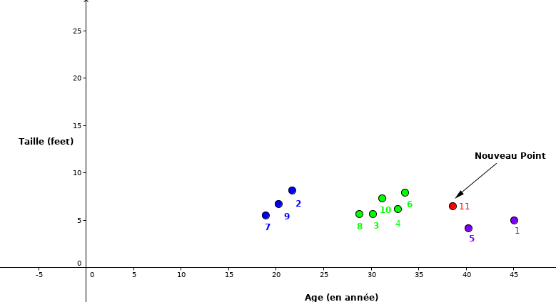
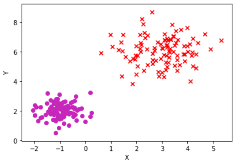
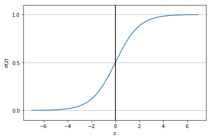

# Apprentissage Supervisé {#ch2}

Dans ce chapitre, nous allons explorer l'apprentissage supervisé. Ce
type d'apprentissage, aussi connu sous le nom d'apprentissage avec
tutelle (maître), permet de déterminer la relation qui existe entre une
variable explicative $\mathbf{X}$ et une variable à expliquer
(étiquette) $\mathbf{y}$. En d'autres termes, l'apprentissage supervisé
est le processus permettant à un modèle d'apprendre, en lui fournissant
des données d'entrée ainsi que des données de sortie. Cette paire
d'entrée/sortie est généralement appelée «données étiquetées». Dans un
cadre illustratif, pensez à un enseignant qui, connaissant la bonne
réponse à une question, évaluera un élève en fonction de l'exactitude de
sa réponse à cette question. Pour plus de clarification, comparons
l'approche de l'apprentissage automatique à la programmation
traditionnelle.

- Dans la programmation traditionnelle, comme illustré dans la figure
  [1.1](#fig:tradi_prog){reference-type="ref"
  reference="fig:tradi_prog"}, nous avons une fonction $f$ connue qui
  reçoit la donnée en entrée $\mathbf{x}$ et renvoie la réponse
  correspondante $\mathbf{y}$ en sortie. Par exemple, nous pouvons
  penser à écrire une fonction $f$ qui calcule le carré d'un nombre;
  si nous donnons en entrée le nombre $2$, notre programme va nous
  renvoyer la valeur $\displaystyle f(2) = 2^2 = 4 = y$.

  {#fig:tradi_prog
  width="0.5\\linewidth"}

- L'approche de la programmation utilisée dans l'apprentissage
  automatique est tout à fait différente de la précédente. Dans cette
  dernière, nous ne connaissons pas la fonction $f$ et nous voulons
  donc l'approximer par une fonction $\hat{f}$ en utilisant les
  données à notre disposition. Cette approche est donc divisée en deux
  phases. La première est la phase où nous entraînons notre fonction
  $\hat{f}$ (figure [1.2](#fig:ML_prog_train){reference-type="ref"
  reference="fig:ML_prog_train"}). Si nous revenons à notre exemple
  précédent, cette étape pourra consister à présenter à la fonction
  $\hat{f}$, plusieurs couples de nombres et leurs carrés
  $\{(2, 4), (3, 9), (4, 16), \cdots\}$. L'objectif ici est de trouver
  un moyen d'estimer la fonction \"carrée\" en observant uniquement
  les données à notre disposition.

  {#fig:ML_prog_train
  width="0.5\\linewidth"}

  La dernière étape consiste à fournir un nouveau nombre à notre
  fonction $f^\star$, obtenue après l'étape $1$, afin qu'elle prédise
  (_approximativement_) le carré de ce nombre.

  {#fig:ML_prog_test
  width="0.6\\linewidth"}

  Dans la suite du cours, nous reviendrons beaucoup plus en détails
  sur les étapes ci-dessus présentées.

L'apprentissage supervisé est souvent utilisé pour deux types de
problèmes: les problèmes de régression et les problèmes de
classification.

## Problèmes de Régression

Dans l'apprentissage supervisé, on parle de problèmes de régression
lorsque la variable à expliquer $\mathbf{y}$ est continue. Par exemple
lorsqu'on veut **prédire le prix** d'une bouteille de vin sur la base de
**certaines variables** (le pays de fabrication, qualité, le taux
d'alcool, etc.). Il s'agit bel et bien d'un problème de régression.

### La Régression Linéaire

La régression linéaire est un problème de régression pour lequel le
modèle ou la fonction dépend linéairement de ses paramètres [@reg_lin].
Les différents types de régression linéaire que nous connaissons sont la
régression linéaire affine, la régression linéaire polynomiale et la
régression linéaire à fonctions de base radiales. Dans ce document, nous
allons nous focaliser sur deux types fondamentaux de régression
linéaire: la régression linéaire affine et la régression linéaire
polynomiale.

#### La régression linéaire affine

Une régression linéaire de paramètre $\boldsymbol{\theta}$ est dite
affine si pour tout $\mathbf{x} \in \mathbb{R}^d.$

$$
f_{\boldsymbol{\theta}}(\mathbf{x}) = \boldsymbol{\theta}_{0} + \boldsymbol{\theta}_{1}^{T} \mathbf{x} = \begin{bmatrix} \boldsymbol{\theta}_0 & \boldsymbol{\theta}_1^{T} \end{bmatrix} \begin{bmatrix}
1 \\
\mathbf{x}
\end{bmatrix}
$$

avec $\boldsymbol{\theta}_0 \in \mathbb{R}$ et
$\boldsymbol{\theta}_1 \in \mathbb{R}^d.$ Le terme
$\left[ 1, \mathbf{x}\right]$ est appelé attribut du modèle et il sera
noté par $\phi(\mathbf{x}).$

::: {.center}
{#exdonnee width="60%"}
:::

Les jeux de données représentés dans la figure
[1.4](#exdonnee){reference-type="ref" reference="exdonnee"} forment un
ensemble d'entraînement où la régression linéaire affine sera la plus
appropriée.\
Pour déterminer les meilleurs paramètres de la régression linéaire
affine deux différentes méthodes sont utilisées à savoir: la méthode
explicite et la méthode approximative.

- **La méthode explicite**

  Dans le cas de la régression linéaire affine, la méthode explicite
  peut-être utilisée par le biais de l'estimation du maximum de
  vraisemblance qui interpelle la notion de probabilité
  conditionnelle.

  Pour être plus concret, nous allons considérer l'expression
  suivante:\
   $y_i = f_{\boldsymbol{\theta}} (\mathbf{x}_i) + \varepsilon~~~$ avec
  $\varepsilon \sim N(0, \sigma^2)$.

  Dans cette expression, nous supposons que $f$ est la fonction que
  nous allons estimer à partir de son paramètre $\boldsymbol{\theta}$
  et qui nous permettra de faire nos prédictions pour chaque élément
  donné à partir du domaine d'entraînement. Nous noterons par $\hat f$
  comme étant la fonction estimée de $f$.

  Pour une suite de points
  $(\mathbf{x}_1, y_1), (\mathbf{x}_2, y_2),..., (\mathbf{x}_n, y_n)$
  représentant le domaine d'entraînement nous supposons que les $y_i$
  suivent chacun une loi normale et qu'ils sont aussi indépendants et
  identiquement distribués (i.i.d).

  Alors, nous avons
  $\mathbf{x} = \left\lbrace \mathbf{x}_1, \mathbf{x}_2, ..., \mathbf{x}_n\right\rbrace  \in \mathbb{R}^{n \times d}$
  et
  $\mathbf{y} = \left\lbrace y_1, y_2, ..., y_n\right\rbrace  \in \mathbb{R}^{n}$.

  Déterminons le paramètre $\boldsymbol{\theta} ^{*}$ qui maximise la
  vraisemblance. $$\begin{aligned}
    \mathbb{P}(y_1, y_2,.., y_n|  \mathbf{x}_1, \mathbf{x}_2, \cdots \mathbf{x}_n; \boldsymbol{\theta}) &= \mathbb{P}(\mathbf{y}|\mathbf{x}; \boldsymbol{\theta}) 
    \\
    &= \prod_{i}^{n}\mathbb{P}(y_i| \mathbf{x}_i, \boldsymbol{\theta})~~ \text{avec }  y_i \sim N(\boldsymbol{\theta}^T \mathbf{x}_i; \sigma^2)\end{aligned}$$
  Dans ce cas nous avons:

  $$\mathbb{P}(y_i| \mathbf{x}_i; \boldsymbol{\theta}) = \frac{1}{\sigma \sqrt{2\pi }}\exp \left(-\frac{(yi - \boldsymbol{\theta}^T \mathbf{x_i})^2}{2 \sigma^2}\right).$$

  Nous savons que, la fonction logarithme est une fonction strictement
  croissante, ce qui implique que le paramètre
  $\boldsymbol{\theta} ^*$ qui maximise la vraisemblance maximise
  aussi le logarithme-vraisemblance. Ainsi, en appliquant le
  logarithme de la vraisemblance, nous avons:\
   $$\log \mathbb{P}(\mathbf{y}|  \mathbf{x}; \boldsymbol{\theta}) = \sum_{i=1}^{n} \log \mathbb{P}(y_i| \mathbf{x}_i; \boldsymbol{\theta}).$$

  Pour chaque
  $i \in \left\lbrace 1, 2, ..., n\right\rbrace  ,~\log \mathbb{P} (y_i| \mathbf{x}_i; \boldsymbol{\theta}) =\log\left(\frac{1}{\boldsymbol{\sigma} \sqrt{2\pi}}\right)~ -\frac{\left(y_i - \boldsymbol{\theta}^T \mathbf{x}_i\right)^2}{2 \sigma^2}$

  $$
  \begin{aligned}
  \implies \log \mathbb{P} (\mathbf{y}| \mathbf{x}; \boldsymbol{\theta}) &= -\frac{1}{2 \sigma^2} \sum_{i=1}^{n}(y_i - \boldsymbol{\theta}^T \mathbf{x}_i)^2 +c^{ste}
  \\
  \\
  &= -\frac{1}{2 \sigma^2} (\mathbf{y} - \boldsymbol{\theta} \mathbf{x})^T (\mathbf{y} - \boldsymbol{\theta} \mathbf{x}) + c^{ste}\end{aligned}
  $$

  Ainsi, la dérivée partielle du logarithme de la vraisemblance par
  rapport à $\boldsymbol{\theta}$ est donnée par:

  $$
  \begin{aligned}
  \dfrac{\partial \log \mathbb{P} (\mathbf{y}| \mathbf{x}, \boldsymbol{\theta})}{\partial \boldsymbol{\theta}} & = \frac{\partial}{\partial \boldsymbol{\theta}} \left( -\frac{1}{2 \sigma^2} (\mathbf{y} - \mathbf{x} \boldsymbol{\theta})^T (\mathbf{y} - \mathbf{x} \boldsymbol{\theta} ) + c^{ste} \right)
  \\
  \\
  %& =  -\frac{1}{\sigma^2} (y - \boldsymbol{\theta} X)^T (y - \boldsymbol{\theta} X)
  & = \frac{1}{\sigma^2} \mathbf{x}^T(\mathbf{x}\boldsymbol{\theta} - \mathbf{y}).\end{aligned}
  $$

  Alors, résoudre l'équation: $$
      \displaystyle \frac{\partial \log \mathbb{P}(\mathbf{y}| \mathbf{x}, \boldsymbol{\theta})}{\partial \boldsymbol{\theta}} = 0$$
  nous permettra de trouver la valeur de $\boldsymbol{\theta}^*$.

  $$
  \begin{aligned}
      \frac{\partial \log \mathbb{P}(\mathbf{y}| \mathbf{x}, \boldsymbol{\theta})}{\partial \boldsymbol{\theta}} &=0,\\
      \mathbf{x}^T(\mathbf{x}\boldsymbol{\theta} - \mathbf{y}) &= 0, \\
      \mathbf{x}^T\mathbf{x}\boldsymbol{\theta} &= \mathbf{x}^T\mathbf{y}.\end{aligned}
  $$

  En supposant que la matrice $\mathbf{x}^T\mathbf{x}$ est inversible
  nous avons : $$
    \boldsymbol{\theta}^{*} = (\mathbf{x}^T\mathbf{x})^{-1}\mathbf{x}^T\mathbf{y}.$$

  Alors, vu que nous avons déterminé le paramètre
  $\boldsymbol{\theta}^{*}$, la fonction $\hat{\boldsymbol{f}}$
  associée au paramètre $\boldsymbol{\theta}^{*}$, souvent appelée
  \"hypothèse\" ou \"modèle\" s'écrit comme
  $$\hat{\boldsymbol{f}}(\mathbf{x}) = \boldsymbol{\theta}^{*}\mathbf{x}.$$

  [\[droite\]]{#droite label="droite"}

  ::: {.center}
  {#droitelin width="50%"}
  :::

  La méthode explicite nous permet d'obtenir la solution exacte de
  l'équation [\[equat\]](#equat){reference-type="eqref"
  reference="equat"}. Tout de même, trouver cette solution exacte est
  souvent très compliquée dans le cas où l'étude se fait sur un grand
  ensemble de jeux de données (la complexité pour trouver l'inverse
  dans l'équation [\[star\]](#star){reference-type="eqref"
  reference="star"} est $\mathcal{O}(n^{3})$). Pour cela, dans ce qui
  suit, nous allons présenter des méthodes alternatives qui nous
  permettront de donner une valeur approchée à la solution exacte.

- **Méthodes approximatives**

  Dans cette partie, nous allons utiliser une méthode itérative pour
  estimer la valeur des paramètres de l'équation suivante:\

  $$
  \mathbf{y}=\boldsymbol{\theta} \mathbf{x}
    $$,\
  où $\boldsymbol{\theta} \in \mathbb{R}^{d+1}$ est le vecteur de
  paramètres à estimer;
  $\mathbf{X} = \left\lbrace \mathbf{x}_1, \mathbf{x}_2, ..., \mathbf{x}_n\right\rbrace  \in \mathbb{R}^{n \times (d+1)}$
  et
  $\mathbf{y} = \left\lbrace y_1, y_2, ..., y_n\right\rbrace  \in \mathbb{R}^{n}$
  les données.
  $$

  **La fonction de perte**

  La fonction de perte mesure la différence entre la valeur observée
  et la valeur estimée. En apprentissage automatique, l'objectif est
  d'optimiser la fonction de perte. Il existe différentes fonctions de
  perte selon le critère (ou métrique permettant d'évaluer la
  performance du modèle) adopté(e). Dans cette partie, nous allons
  utiliser l'erreur quadratique moyenne (appelé Mean Square Error
  (MSE) en anglais) pour définir notre fonction de perte.

  L'erreur quadratique moyenne entre le $\mathbf{y}$ observé et le
  $\mathbb{\hat{y}}$ prédit est donnée par:

  $$
  \begin{aligned}
  \operatorname{MSE}(\mathbf{y}, \hat{\boldsymbol{y}}) & = \frac{1}{n}\sum_{i=1}^{n}(y_i - \hat{y}_i)^2,\end{aligned}
  $$

  où $n$ est la dimension des vecteurs $\mathbf{y}$ et
  $\hat{\boldsymbol{y}}$.

  Dans le cas de la régression linéaire, cette fonction peut être
  réécrite comme étant une fonction $E$ de $\boldsymbol{\theta}$.
  $$E\left(\boldsymbol{\theta}\right)  = \frac{1}{n}\sum_{i=1}^{n}(y_i - \boldsymbol{\theta}^{T} \mathbf{x}_i)^2.$$

  Par conséquent, le paramètre $\boldsymbol{\theta}$ qui correspond à
  la meilleure ligne d'ajustement sera tout simplement la valeur qui
  minimise la fonction de perte $E$. Pour cela, nous allons introduire
  une méthode la plus souvent utilisée pour minimiser une fonction
  (éventuellement convexe) dans l'apprentissage automatique à savoir
  la descente de gradient.

  [\[f_convexe\]]{#f_convexe label="f_convexe"}

  ::: {.center}
  {#f_convexe width="40%"}
  :::

#### Descente de gradient {GD}

La descente de gradient est une procédure itérative d'optimisation
dans laquelle, à chaque étape, on améliore la solution en essayant
de minimiser la fonction de perte considérée [@desc_grad]. Elle est
appliquée lorsque l'on cherche le minimum d'une fonction dont on
connaît l'expression analytique, qui est dérivable, mais dont le
calcul direct du minimum est difficile.

Pour entamer cette procédure, nous allons commencer par initialiser
le paramètre $\boldsymbol{\theta}$. Ensuite, nous calculons la
dérivée partielle de la fonction $E$ par rapport au paramètre
$\boldsymbol{\theta}$ donnée par:

$$\frac{\partial E}{\partial \boldsymbol{\theta}} = -\frac{2}{n} \sum_{i=1}^{n} \mathbf{x}_i(y_i - \boldsymbol{\theta}^{T} \mathbf{x}_i).$$

Pour trouver les meilleurs paramètres, nous allons répéter le
processus ci-dessous jusqu'à ce que la fonction de perte soit très
proche ou égale à $0$.

$$\boldsymbol{\theta} = \boldsymbol{\theta} - \gamma \cdot \frac{\partial E}{\partial \boldsymbol{\theta}},$$

La valeur de $\boldsymbol{\theta}$ trouvée après convergence est la
valeur optimale que nous noterons par $\boldsymbol{\theta}^*$.

Alors, concernant l'exemple de la figure
[1.4](#exdonnee){reference-type="ref" reference="exdonnee"}, notre
hypothèse ou modèle sera représenté par une droite d'ajustement de
la même forme que celle en couleur verte sur la figure
[1.5](#droitelin){reference-type="ref" reference="droitelin"}. Cette
droite est d'équation:

::: {.center}
$\mathbf{y} = \boldsymbol{\theta}^*\mathbf{x}$.
:::

**Implementation**\

::: {.algorithm}
::: {.algorithmic}
class **LinearRégression**():    def **\_\_init\_\_** (self):       pass
   def **fonction_perte**(self, y_vrai, y_prédit):       définit une
fonction de perte et retourne sa valeur    def **algorithme**(self,
$\mathbf{x}$, $\mathbf{y}$, taux_apprentissage, nombre_itération):
      initialiser les paramètres $\boldsymbol{\theta}_0$ et
$\boldsymbol{\theta}_1$

for i in range(nombre_itération):           **prédiction**(x),
          calcule la perte au moyen de **fonction_perte**,          
mise à jour des paramètres $\boldsymbol{\theta}_0$ et
$\boldsymbol{\theta}_1$,           return $\boldsymbol{\theta}_0$,
$\boldsymbol{\theta}_1$,    def **prédiction**(self, $\mathbf{x}$):
      y_prédit
$= \boldsymbol{\theta}_0^T \mathbf{x} +  \boldsymbol{\theta}_1$,
      return y_prédit
:::
:::

Un exemple d'implementation de régression linéaire est disponible
[ici](https://colab.research.google.com/drive/1Ad94wJI2hch6BxpRV9P-SZcc3UfI2zwY#scrollTo=BPyCNZ9Z6tMg)

#### La régression linéaire polynomiale

La régression linéaire de paramètre $\boldsymbol{\theta}$ est dite
polynomiale si pour tout $\mathbf{x} \in \mathbb{R}^d,$

$$
\begin{aligned}
\text{f}_{\boldsymbol{\theta}}(\mathbf{x}) &= \boldsymbol{\theta}_0 + \boldsymbol{\theta}_1 \mathbf{x}^1 +...+ \boldsymbol{\theta}_m \mathbf{x}^{m}
\\
&= \left[ \boldsymbol{\theta}_0, \boldsymbol{\theta}_1, ..., \boldsymbol{\theta}_m\right] \begin{bmatrix}
1 \\
\mathbf{x}^{1} \\
\vdots \\
\mathbf{x}^{m}
\end{bmatrix}
\\
&=\sum_{i=0}^{m} \boldsymbol{\theta}_i \mathbf{x}^{i},\end{aligned}
$$

avec comme attribut le vecteur
$\phi (\mathbf{x}) = \left[ 1, \mathbf{x}^1, ..., \mathbf{x}^m\right]^T$.
Ainsi, deux méthodes existent pour déterminer le meilleur paramètre
$\boldsymbol{\theta}^*$.

1.  **Estimation par la méthode du maximum de vraisemblance (appelée
    MLE: Maximum Likelihood Estimation)**: Suivant de manière analogique
    de la détermination du paramètre $\boldsymbol{\theta}^*$ sur la
    partie précédente, la meilleure valeur du paramètre
    $\boldsymbol{\theta}^{*}$ est déterminée par
    $\boldsymbol{\theta}^*= (\mathbf{x}^T \mathbf{x})^{-1}\mathbf{x}^T\mathbf{y}.$

2.  **Estimation par la méthode d'un posteriori maximal (appelée MAP:
    Maximum A Posteriori)**: La méthode consiste à trouver la valeur
    $\boldsymbol{\theta}^{*}_{\mathrm{MAP}}$ qui maximise le produit
    entre la vraisemblance et la distribution à priori des paramètres
    $\boldsymbol{\theta}$ comme l'indique l'équation
    [\[naivebayes\]](#naivebayes){reference-type="ref"
    reference="naivebayes"}. Cette méthode d'estimation apparaît
    généralement dans un cadre bayésien. Tout comme la méthode du
    maximum de vraisemblance, elle peut être utilisée afin d'estimer un
    certain nombre de paramètres inconnus, comme les paramètres d'une
    densité de probabilité, reliés à un échantillon donné. La seule
    différence avec la méthode de maximum de vraisemblance est sa
    possibilité de prendre en compte un à priori non uniforme sur les
    paramètres à estimer. Ainsi, nous pouvons dire que l'estimateur au
    maximum de vraisemblance est l'estimateur MAP pour une distribution
    à priori uniforme.
    Par le théorème de Bayes, nous pouvons obtenir le postérieur comme
    un produit de vraisemblance avec :
    $$
    \begin{aligned}
            \mathbb{P}\left(\boldsymbol{\theta}|\mathbf{y};\mathbf{x} \right) &= \frac{\mathbb{P}\left(\mathbf{y};\mathbf{x}|\boldsymbol{\theta}\right) \mathbb{P}\left(\boldsymbol{\theta} \right)}{\mathbb{P}\left(\mathbf{y};\mathbf{x}\right)}
            \\
            & \propto \mathbb{P}\left(\mathbf{y};\mathbf{x}|\boldsymbol{\theta}\right)\mathbb{P}\left(\boldsymbol{\theta}\right).\nonumber
        \end{aligned}
    $$

Avec
$\mathbf{Y}| \boldsymbol{\theta} \sim \mathcal{N}(\boldsymbol{\theta}^T \mathbf{x}, \sigma^2)$
et
$\boldsymbol{\theta} \sim \mathcal{N}(\mathbf{0}, \lambda^2 \mathbf{I})$
où $\mathbf{I}$ représente la matrice identité dont la dimension est la
longueur du vecteur $\boldsymbol{\theta}$. Ainsi, nous pouvons écrire la
vraisemblance comme:
$$\mathbb{P}(\boldsymbol{\theta}| \mathbf{y};\mathbf{x}) = \frac{1}{\sigma \sqrt{2\pi }}\exp{\left(-\frac{(y - \boldsymbol{\theta}^T \mathbf{x})^2}{2 \sigma^2}\right)} \frac{1}{\lambda \sqrt{2\pi }} \operatorname{exp}\left(-\frac{\boldsymbol{\theta}^2}{2 \lambda^2}\right)$$

En utilisant la fonction logarithme, nous avons $$\begin{aligned}
 \log \mathbb{P}(\boldsymbol{\theta}|\mathbf{x}, \mathbf{y}) &= \log\left(\frac{1}{\sigma \sqrt{2\pi }}\operatorname{exp}\left(-\frac{(\mathbf{y} - \boldsymbol{\theta}^T \mathbf{x})^2}{2 \sigma^2}\right) \frac{1}{\lambda \sqrt{2\pi }}\exp{\left(-\frac{\boldsymbol{\theta}^2}{2 \lambda^2}\right)} \right)\\
 &= -\frac{1}{2 \sigma^2}(\mathbf{y} - \boldsymbol{\theta}^T \mathbf{x})^2 -\frac{1}{2 \lambda^2}\boldsymbol{\theta} ^2 + c^{te} 
\\
& = -\frac{1}{2 \sigma^2}||\mathbf{y} - \boldsymbol{\theta} \mathbf{x}||^2 -\frac{1}{2 \lambda^2}||\boldsymbol{\theta}|| ^2 + c^{te}.\end{aligned}$$

Et le paramètre à estimer $\boldsymbol{\theta}^*$ correspond au
$\boldsymbol{\theta}$ qui annule la dérivée partielle de
$\log \mathbb{P}(\mathbf{y}| \mathbf{x}, \boldsymbol{\theta})$ par
rapport à $\boldsymbol{\theta}$.

::: {.center}
$\displaystyle \frac{\partial \log \mathbb{P}(\mathbf{y}| \mathbf{x}, \boldsymbol{\theta})}{\partial \boldsymbol{\theta}} = 0
    \Longleftrightarrow  \frac{\partial \log}{\partial \boldsymbol{\theta}}\left(-\frac{1}{2 \sigma^2}||\mathbf{y} - \boldsymbol{\theta} \mathbf{x}||^2 -\frac{1}{2 \lambda^2}||\boldsymbol{\theta}||^2 + c^{te} \right) = 0$.
:::

$\linebreak$ Ceci revient à déterminer le $\boldsymbol{\theta}$ qui
annule l'expression $$\begin{aligned}
  \frac{1}{ \sigma^2}\mathbf{x}^T (\mathbf{y} - \boldsymbol{\theta} \mathbf{x}) -\frac{1}{ \lambda^2} \boldsymbol{\theta}. \end{aligned}$$

Alors, $$\begin{aligned}
    &-\frac{1}{ \sigma^2}\mathbf{x}^T (\mathbf{y} - \boldsymbol{\theta} \mathbf{x}) -\frac{1}{ \lambda^2} \boldsymbol{\theta} = 0
    \Longleftrightarrow
    -\frac{1}{ \sigma^2}\mathbf{x}^T \mathbf{y} + \frac{1}{ \sigma^2} \boldsymbol{\theta} \mathbf{x}^T \mathbf{X} - \frac{1}{\lambda^2}\boldsymbol{\theta} = 0
    \\
    \\
    &~(\frac{1}{\sigma^2}\mathbf{x}^T \mathbf{x} - \frac{1}{\lambda^2}) \boldsymbol{\theta} = \frac{1}{\sigma^2}\mathbf{x}^T \mathbf{y}
    \Longleftrightarrow
  \boldsymbol{\theta}^* = \left(\mathbf{x}^T \mathbf{x} - \frac{\sigma^2}{\lambda^2} \mathbf{I} \right)^{-1} \mathbf{x}^T\mathbf{y}.\end{aligned}$$

Cas Pratique

## Les Problèmes de Classification

A la différence avec le problème de régression, la classification est un
autre type de problème d'apprentissage supervisé où la variable à
prédire est discrète (ou qualitative ou catégorique). Cette variable
discrète peut être binaire (deux classes) ou multiple (multi-classe).
Par exemple lorsqu'on veut **catégoriser** si un e-mail reçu est un
'spam' ou \"non-spam\" il s'agit bel et bien d'un problème de
classification.

### L'algorithme des $K$ plus proches voisins ($K$-NN)

L'algorithme des $K$ plus proches voisins aussi appelé $K$-Nearest
Neighbors ($K$-NN) en anglais est une méthode d'apprentissage supervisé
utilisée pour la classification aussi bien que la régression :cite:`goodfellow2016deep`
[@goodfellow2016deep]. Il est compté parmi les plus simples algorithmes
d'apprentissage automatique supervisé, facile à mettre en oeuvre et à
comprendre.

Toutefois dans l'industrie, il est plus utilisé pour les problèmes de
classification. Son fonctionnement se base sur le principe suivant: _dis
moi qui sont tes voisins, je te dirais qui tu es \..._

L'objectif de cet algorithme est de déterminer la classe d'une nouvelle
observation $x$ en fonction de la classe majoritaire parmi ses $K$ plus
proches voisins. Donc l'algorithme est basé sur la mesure de similarité
des voisins proches pour classifier une nouvelle observation $x$.

La méthode des $K$ plus proches voisins, où $K$ représente le nombre de
voisins proches est une méthode non-paramétrique. Cela signifie que
l'algorithme permet de faire une classification sans faire d'hypothèse
sur la fonction $y=f(\mathbf{x}_1,\mathbf{x}_2, \dots \mathbf{x}_n)$ qui
relie la variable dépendante $\mathbf{y}$ aux variables indépendantes
$\mathbf{x}_1,\mathbf{x}_2, \dots, \mathbf{x}_n$.

Soit $\mathcal{D}$ l'ensemble des données ou l'échantillon
d'apprentissage, défini par:
$$\mathcal{D}=\{(\mathbf{x}_i, y_i), i=1, \dots, n\},$$ où
$y_i \in \{1,\dots,c\}$ dénote la classe de la donnée $i$ et
$\mathbf{x}_i=(\mathbf{x}_{i1}, \dots, \mathbf{x}_{im})$ est le vecteur
représentant les variables (attributs) prédictrices de la donnée $i$.

Supposons un nouveau point $\textbf{p}$ pour lequel nous voulons prédire
la classe dans la quelle il doit appartenir comme indiqué dans la figure
[1.7](#fig:Knn){reference-type="ref" reference="fig:Knn"}.

{#fig:Knn width="0.6\\linewidth"}

La première chose à faire est de calculer la distance entre le point
$\textbf{p}$ avec tous les autres points. Ensuite trouver les $K$ points
les plus proches de $\textbf{p}$. C'est-à-dire les $K$ points dont la
distance avec $\textbf{p}$ est minimale. Les $K-$points plus proches de
$\textbf{p}$ dans l'échantillon d'apprentissage sont obtenus par:

$$\underset{\mathbf{x}_i}{K-\mbox{argmin}}\  \{d(\textbf{p},\mathbf{x}_i), i=1, \dots, n\}.$$

Pour tout
$i \in \{1, \dots, n\},  d_{p, i} := \{ d(p, \mathbf{x}_i), ~ i = 1, \dots, n \}$
où $d$ est une fonction de distance. Et en suite la classe prédite de
$\textbf{p}$ notée $\hat{\textbf{y}}$ est la classe majoritairement
représentée par les $k$ voisins.

Les points similaires ou les points les plus proches sont sélectionnés
en utilisant une fonction de distance telle que la distance
euclidienne [\[Euclidienne\]](#Euclidienne){reference-type="eqref"
reference="Euclidienne"}, la distance de
Manhattan [\[Manhattan\]](#Manhattan){reference-type="eqref"
reference="Manhattan"} et la distance de Minkowski
 [\[Minkowski\]](#Minkowski){reference-type="eqref"
reference="Minkowski"}. On choisit la fonction de distance en fonction
des types de données manipulées, par exemple dans le cas où les données
sont quantitatives et du même type, c'est la distance euclidienne qui
est utilisée.

Les points les plus proches de $P$ sont trouvés en utilisant une
fonction de distance telle que la distance Euclidienne, la distance de
Minkowski et la distance de Manhattan.

#### Algorithme

Soient $\mathcal{D}$ un échantillon d'apprentissage des observations
$\mathbf{x}_i$ relatives à une classe $y_i$
$\mathcal{D}=\{(\mathbf{x}_i, y_i), i=1, \dots,n\}$ et $\textbf{p}$ une
nouvelle observation dont la classe $\hat{c}$ doit être prédite. **Les
étapes de l'algorithme:** Ainsi, l'algorithme se présente comme suit:

1.  Choisir le paramètre $K$, le nombre de voisins les plus proches;

2.  Calculer la distance de la nouvelle observation $\textbf{p}$ avec
    tous les autres échantillons selon une fonction de distance choisie
    $d(p, \mathbf{x}_i);$

3.  Sélectionner les $K$ plus proches voisins de $\textbf{p}$;

4.  Former la collection $K_c$ des étiquettes des $K$ plus proches
    voisins de $\textbf{p}$;

5.  Et la classe de $\textbf{p}$, $\hat{c}$ est choisie d'après la
    majorité des $K_c$ plus proches voisins, c'est-à-dire
    $$\hat{c}=\mbox{Mode}(K_c)$$.

6.  Répéter l'étape 2 à 5 pour chaque nouveau point à classifier.

L'algorithme [\[algorithme_knn\]](#algorithme_knn){reference-type="ref"
reference="algorithme_knn"} nous présente le pseudo-code de la méthode
de plus proches voisins.

::: {.algorithm}
::: {.algorithmic}
Un ensemble de données
$\mathcal{D} = \{(\mathbf{x}_i, y_i)\}, i = 1, \dots,n$ Choisir une
fonction de distance $d$ Choisir un nombre $K \in \mathbb{N}^*$ Pour une
nouvelle observation $\textbf{p}$ dont on veut prédire la classe
$\hat{c}$:      Calculer la distance $d(\textbf{p},\mathbf{x}_i)$
     Retenir les $K$ observations proches de $\textbf{p}$:
$\underset{\mathbf{x}_i}{K-\arg \min}\  \{d(\textbf{p},\mathbf{x}_i), i=1, \dots, n\}$
     Prendre les valeurs $\displaystyle y_{k}$ des $K$ observations
retenues:           Si on effectue une régression:
$\hat{c}= \frac{1}{K}\sum_{k=1}^{K} y_k$ (la moyenne ou la médiane des
$y_k$ retenues)           Si on effectue une classification : Calculer
le mode des $y_k$ retenues      Retourner $\hat{c}$, la valeur qui a été
prédite par $K$-NN pour l'observation $\textbf{p}$.
:::
:::

#### Comment choisir la valeur de $K$ ?

- En générale, le choix de la valeur de $K \in \mathbb{N}^{*}$ dépend
  du jeu de données. Pour la classification binaire (en deux classes)
  par exemple il est préférable de choisir la valeur $K$ impaire pour
  éviter les votes égalitaires. Historiquement, la valeur optimale de
  $K$ pour la plupart de données est choisie entre 3 et 10
  [@shalev2014understanding].

- Une optimale valeur de $K$ peut être sélectionnée par diverses
  techniques heuristiques dont la **validation-croisée** (que nous
  allons expliquer ci-dessous).

- Notons que, si l'algorithme est utilisé pour la régression, c'est la
  moyenne (ou la médiane) des variables $\mathbf{y}$ des $K$ plus
  proches observations qui sera utilisée pour la prédiction. Et dans
  le cas de la classification, c'est le mode des variables
  $\mathbf{y}$ des $K$ plus proches observations qui servira pour la
  prédiction.

**Validation-croisée (Cross-Validation)**

La Validation-croisée (_Cross-validation_) est une méthode très
populaire utilisée pour estimer la performance d'un algorithme. C'est
une méthode statistique souvent utilisée dans des procédures
d'estimation et aussi pour la sélection de modèles [@chen2019mehryar].

Son principe est le suivant :

- séparer les données en données en deux échantillon (apprentissage et
  validation);

- construire l'estimateur sur l'échantillon d'apprentissage et
  utiliser l'échantillon de validation pour évaluer l'erreur de
  prédiction;

- Répéter plusieurs fois le processus et enfin faire une moyenne des
  erreurs de prédiction obtenues.

C'est une technique très utilisée pour le choix de meilleurs paramètres
et hyperparamètres d'un modèle, par exemple pour le choix de la
meilleure valeur de $K$ dans l'algorithme de plus proches voisins
($K$-NN).

On distingue les variantes suivantes de la technique de
validation-croisée:

- $K$-fold cross-validation : Partitionnement des données en $K$
  sous-ensembles. Chaque sous-ensemble sert à tour de rôle
  d'échantillon de validation et le reste de sous-ensembles
  d'échantillon d'apprentissage. En pratique la valeur de $K$ varie
  entre $5$ et $10$.

- Leave-one-out cross-validation: qui signifie de laisser à tour de
  rôle une observation comme échantillon de validation et le reste des
  données comme échantillon d'apprentissage. C'est un $n$-fold
  validation-croisée avec $n$, le nombre total d'observations.

- Leave-$q$-out qui signifie de laisser à tour de rôle $q$
  observations comme échantillon de validation et le reste des données
  comme échantillon d'apprentissage. C'est une $\lceil
    \frac{n}{q}\rceil$-fold validation-croisée.

D'une manière générale, la procédure de partitionnement des données se
présente souvent comme suit:

$$
\begin{aligned}
    \underbrace{Apprentissage }_{70\%} +
    \underbrace{Validation}_{10\%}+
    \underbrace{Test}_{20\%}\end{aligned}
$$

- Les données d'apprentissage permettent de trouver un estimateur.

- Les données de validation nous permettent de trouver les meilleurs
  paramètres du modèle.

- Les données test permettent de calculer l'erreur de prédiction
  finale. Notons que cette méthode de validation-croisée est utilisée
  pour tous types d'algorithme d'apprentissage.

#### Les avantages de l'algorithme de $K$-NN

- Il est simple, facile à interpréter.

- Il n'existe pas de phase d'apprentissage proprement dite comme c'est
  le cas pour les autres algorithmes, c'est pour cela qu'on le
  classifie dans le _Lazy Learning._

- Offre des performances très intéressantes lorsque le volume de
  données d'apprentissage est trop large.

- Le temps d'exécution est minimum par rapport à d'autres algorithmes
  de classification.

- Il peut être utilisé pour classification et régression.

- Il ne fait pas d'hypothèse (linéaire, affines,..) sur les données.

#### Les limitations de l'algorithme de $K$-NN

- L'algorithme a plus besoin de mémoire car l'ensemble des données
  doivent être garder dans cette dernière pour pouvoir effectuer la
  prédiction d'une nouvelle observation à chaque fois.

- Sensibles aux attributs non pertinents et non corrélés.

- L'étape de la prédiction peur être lente dû au calcul de distance de
  chaque nouvelle observation avec les jeux de données en entier à
  chaque prédiction.

- Le choix de la fonction de distance ainsi que le nombre de voisins
  $K$ peut ne pas être évident. C'est ainsi qu'il faut essayer
  plusieurs combinaisons(en utilisant la méthode de
  validation-croisée) pour avoir un bon résultat.

#### Exemple pratique

Ci-dessous, nous allons prendre un exemple simple pour comprendre
l'intuition derrière l'algorithme de $K$-NN. Considérons le tableau de
données ci-dessous qui contient la taille (feet), l'âge (année) et le
poids(en kilogramme) de $10$ personnes où ID représente l'identifiant de
chaque personne dans le tableau. Comme vous le remarquez le poids du ID
$11$ est manquant. Nous allons appliquer l'algorithme de $K$-NN pour
prédire le poids de la personne ID 11.

::: {#tab:rrr}
   **ID**   **Taille**   **Âge**   **Poids**
  -------- ------------ --------- -----------
     1          5          45         77
     2         5.11        26         47
     3         5.6         30         55
     4         5.9         34         59
     5         4.8         40         72
     6         5.8         36         60
     7         5.3         19         40
     8         5.8         28         60
     9         5.5         23         45
     10        5.6         32         58
     11        5.5         38          ?

  : Données pour l'illustration
:::

[\[tab:rrr\]]{#tab:rrr label="tab:rrr"}

Nous pouvons représenter graphiquement les données du tableau
[1.1](#tab:rrr){reference-type="ref" reference="tab:rrr"} en se basant
sur la taille et l'âge.

{#fig:knnnew width="0.6\\linewidth"}

Comme nous le remarquons, le point rouge (ID 11) est notre nouvelle
observation dont nous voulons prédire la classe dans laquelle il
appartient.

**Étape 1:** Commençons par choisir le nombre des voisins les plus
proche. Pour notre cas prenons $K=5$.

**Étape 2:** Calculer la distance entre le nouveau point (rouge) avec
tous les autres points

{#fig:step2knn width="0.6\\linewidth"}

**Étape 3:** Sélectionner les $5$ plus proches voisins.

{#fig:selectknn width="0.6\\linewidth"}

**Étape 4:** Pour la valeur de $K=5$, les points les plus proches sont
$1,\ 4,\ 5,\ 6\text{ et } 10.$

**Étape 5:** Ainsi, comme la classe des points $4,\ 6$ et $10$ est
majoritaire donc le point $11$ se classifie dans cette classe. Et comme
c'est un cas de la régression, la prédiction pour ID11 est la moyenne de
ces 5 voisins les plus proches c'est-à-dire
$(77+59+72+60+58)/5=65.2\ Kg$. Ainsi le poids prédit pour ID11 est
$65.2\ Kg$.

### L'algorithme du Perceptron

L'algorithme de perceptron est un algorithme d'apprentissage supervisé
utilisé pour la classification binaire (c'est-à-dire séparant deux
classes). C'est l'un des tout premier algorithme d'apprentissage
supervisé et de réseau de neurones artificiels le plus simple. Le terme
vient de l'unité de base dans un
[neurone](https://fr.wikipedia.org/wiki/R%C3%A9seau_de_neurones_artificiels#Perceptron_2)
qui s'appelle *perceptron*.

C'est un type de classification linéaire, c'est-à-dire que les données
d'apprentissage sont séparées par une droite classées dans des
catégories correspondantes de telle sorte que si la classification à
deux catégories est appliquée, toutes les données sont rangées dans ces
deux catégories. Dans ce cas on cherche à trouver un hyperplan qui
sépare correctement les données en deux catégories. Comme nous le voyons
dans la figure [1.12](#fig:perceptron){reference-type="ref"
reference="fig:perceptron"} ci-dessous.

{#fig:perceptron
width="5cm"} {#fig:perceptron
width="5cm"}

L'idée générale de l'algorithme du perceptron est d'initialiser le
vecteur de poids réels $\mathbf{w} \in \mathbb{R}^d$ au vecteur nul ou à
une variable aléatoire, itérer un nombre de fois jusqu'à la convergence
sur les données d'apprentissage.

Soient $\mathcal{D} = \{(\mathbf{x}_i, y_i)\}^{n}_{i=1}$, un ensemble de
données où $\mathbf{x}_i \in \mathbb{R}^d$ est le vecteur d'entrées de
dimension $d$ et l'étiquette $y_i \in \{-1,1\}$;
$\mathbf{w} \in \mathbb{R}^d$ un vecteur poids de dimension $d$.

L'objectif est de trouver un hyperplan $\mathbf{w}.\mathbf{x} + b=0$ qui
sépare les deux classes. Le terme $b$ est l'intercepte appelé aussi
\"*bias term*\" et $\mathbf{w}\cdot \mathbf{x}$ est le produit scalaire
défini par
$\langle \mathbf{w},\mathbf{x} \rangle := \sum_{s=1}^{d} w_{s} \mathbf{x}_{s}$.

C'est-à-dire apprendre le vecteur $\mathbf{w}$ tel que:
$$\begin{aligned}
  \mathbf{y}& = \operatorname{signe}\left(\mathbf{w}\cdot \mathbf{x} +b\right) 
  \end{aligned}$$ $$\begin{aligned}
  \text{Si } \mathbf{w}\cdot \mathbf{x} +b>0 \text{ alors } \operatorname{sgn}(\mathbf{w}\cdot \mathbf{x} +b) =+1, \text{ pour tout } \mathbf{x} \text{ appartenant \`a la classe positive.}\\
  \text{Si } \mathbf{w}\cdot \mathbf{x} + b \leq 0 \text{ alors } \operatorname{sgn}(\mathbf{w}\cdot \mathbf{x} +b) = -1, \text{ pour tout } \mathbf{x} \text{ appartenant \`a la classe négative.}
  \end{aligned}$$

  #### Algorithme

Soient les données d'apprentissage
$\mathcal{D} = \{(\mathbf{x}_1, y_1), \dots, (\mathbf{x}_n, y_n)\}$ où
$\mathbf{x}_i \in \mathbb{R}^d$, $y_i \in \{-1,1\}$ et $T$ le nombre
d'itérations. L'algorithme se présente comme suit:

::: {.algorithm}
::: {.algorithmic}
Initialiser le vecteur $\mathbf{w} \leftarrow 0$ **Pour** itération de 1
à T: **   Pour** chaque exemple $(\mathbf{x}_i, y_i) \in \mathcal{D}:$
      Calculer la prédiction
$\hat{y_i} = \operatorname{signe }( \mathbf{w}. \mathbf{x}_i +b )$
**      Si** $\hat{y_i} \neq y_i$ **alors**          Ajuster
$\mathbf{w} :$ par
         $\mathbf{w_{t+1}} \leftarrow \mathbf{w_t}+\mathbf{x}_i$ si
$y_i$ est positive
         $\mathbf{w_{t+1}} \leftarrow \mathbf{w_t}-\mathbf{x}_i$ si
$y_i$ est négative       **Fin si**    **Fin pour** **Fin pour**
:::
:::

L'avantage de l'algorithme de perceptron est sa simplicité et son
efficacité de séparer linéairement les données d'apprentissage.
Néanmoins, tous les hyperplans qui séparent les données sont
équivalents.

L'algorithme ne peut séparer et converger vers la solution uniquement
que si les données d'apprentissage sont linéairement séparables. Aussi,
il n'est pas efficace quand il y a beaucoup d'attributs.

### La Régression Logistique

La régression logistique est une méthode de classification simple mais
puissante, pour les données binaires, et elle peut facilement être
étendue à plusieurs classes. Considérons d'abord le modèle de régression
le plus simple, correspondant à celui que nous avons vu précédemment,
pour effectuer la classification. Nous le trouverons bientôt totalement
insuffisant pour ce que nous voulons réaliser et il sera instructif de
voir exactement pourquoi. Le modèle de la régression linéaire comme
défini dans l'équation [\[reg_lin\]](#reg_lin){reference-type="eqref"
reference="reg_lin"}, peut se réécrire comme:
$$h_{\boldsymbol{\theta}}(\mathbf{X})=  \mathbf{X}\boldsymbol{\theta},$$

où $\mathbf{X}$ est une matrice de taille $n\times d$ et
$\boldsymbol{\theta} \in \mathbb{R}^{d}$.

Comme dans de nombreux problèmes d'estimation de paramètres,
$\boldsymbol{\theta}$ est trouvé en minimisant certaines fonctions de
pertes qui capturent à quel point notre prédiction est proche de la
valeur réelle. Quand nous faisons des hypothèses sur la distribution des
données, la fonction de perte est souvent en termes de vraisemblance des
données. Cela signifie que le $\boldsymbol{\theta}$ optimal est celui
pour lequel les données observées ont la probabilité la plus élevée. Par
exemple, la régression linéaire suppose généralement que la variable
dépendante est normalement distribuée autour de la moyenne
$h_{\boldsymbol{\theta}}(\mathbf{x})$. Il peut être montré que la
solution du maximum de vraisemblance est le $\boldsymbol{\theta}$ qui
minimise la somme des erreurs quadratiques (la différence entre les
valeurs prédites et les valeurs correctes). Si nous essayons d'utiliser
la régression linéaire pour un problème de classification (prenons
l'exemple d'une classification binaire) une méthode simple serait de
grouper les données de telle sorte que: $$y= 
\begin{cases}
1,& \text{si } \boldsymbol{\theta}^{T}\mathbf{x} > 0 \quad (\mathbf{x}\in \mathbb{R}^{d}) \\
0,& \text{sinon}
\end{cases}$$ Ceci est illustré par la figure
[1.13](#Figure1){reference-type="ref" reference="Figure1"}.

{#Figure1 width="8cm"
height="8cm"}

#### La régression logistique binaire

La régression logistique ordinaire ou régression logistique binaire vise
à expliquer une variable d'intérêt binaire (c'est-à-dire de type « oui /
non » ou « vrai / faux »). Les variables explicatives qui seront
introduites dans le modèle peuvent être quantitatives (l'âge, la taille,
etc) ou qualitatives (le genre par exemple).

**Exemple**

Dans cet exemple, la variable explicative $x$ est une matrice de
vecteurs colonnes $\mathbf{x}_1, \mathbf{x}_2$ où $\mathbf{x}_1$ est le
vecteur 'apprendre' qui représente le nombre d'heures d'étude de
l'étudiant, et $\mathbf{x}_2$ est le nombre d'heures pendant lesquelles
l'étudiant dort. L'objectif est de prédire si l'étudiant va réussir à
l'examen ou non, respectivement représentée par les classes 1 et 0.

::: {.center}
   Apprendre   Dormir   Réussir  
  ----------- -------- --------- --
     4.85       9.63       1     
     8.62       3.23       0     
     5.43       8.23       1     
     9.21       6.34       0     
:::

Comme dans le cas de la régression linéaire, on suppose que les données
suivent une fonction linéaire de la forme:
$$\mathbf{y}= \boldsymbol{\theta}^T\mathbf{x}.$$ $\mathbf{y}$ représente
la variable à expliquer, $\mathbf{x}$ est la variable explicative et
$\boldsymbol{\theta}$ un paramètre. Comme nous l'avons vu, la variable
$\mathbf{y}$ est une variable continue. Pour utiliser cette technique
dans le cas d'une variable discrète (ici binaire), supposons que $p$ est
la probabilité qu'un événement se réalise; alors $1-p$ est la
probabilité de l'évènement contraire. La variable aléatoire $\mathbf{y}$
qui prend les valeurs 'oui' ou 'non' (1,0 en langage machine) suit la
loi de Bernoulli. On définit ce qu'on appelle la transformation logit
donnée par l'équation suivante:
$$\log\left(\frac{p}{1-p}\right)=\boldsymbol{\theta}^T\mathbf{x} .$$
Cette transformation donne la relation entre la probabilité qu'un
évenment se réalise et la combinaison linéaire des variables. Le rapport
$\frac{p}{1-p}$ est appelé le Rapport de Côte (RC). En appliquant
l'exponentielle sur cette relation on obtient:
$$\frac{p}{1-p} =  e^{\boldsymbol{\theta}^T\mathbf{x}}.$$ Ce qui
implique: $$\begin{aligned}
p &=\frac{e^{\boldsymbol{\theta}^T\mathbf{x}}}{1+e^{\boldsymbol{\theta}^T\mathbf{x}}}\nonumber\\
%&=\frac{1}{\frac{1}{e^{X\boldsymbol{\theta}+1}}}\nonumber\\
&=\frac{1}{1+e^{-\boldsymbol{\theta}^T\mathbf{x}}}\end{aligned}$$

Avec $z= \boldsymbol{\theta}^T\mathbf{x}$, la fonction $\sigma$ définie
par $\displaystyle \sigma(z)=\frac{1}{1+e^{-z}}$ est appelée la fonction
Sigmoïde ou logistique. Dans les lignes qui suivent, nous allons donner
certaines de ses propriétés.

### La fonction Sigmoïde et ses propriétés

Elle est définie par: $$\sigma(z)=\dfrac{1}{1+e^{-z}},
    $$

La représentation graphique de la fonction Sigmoïde est donnée par la
figure [1.14](#sigmoid){reference-type="ref" reference="sigmoid"}.

{#sigmoid width="13cm"
height="10cm"}

Une qualité importante de cette fonction est qu'elle transforme tous les
nombres réels sur la plage $[0, 1]$. En régression logistique, cette
transformation $\sigma (z)$ nous permet d'avoir une vue probabiliste qui
est d'une importance cruciale pour la classification. Avec cette
fonction, les nombres positifs deviennent des probabilités élevées; les
nombres négatifs deviennent de faible probabilité.

Comme vous l'avez sûrement remarqué, l'algorithme de régression linéaire
repose sur l'obtention d'un paramètre $\boldsymbol{\theta}^{*}$ dit
optimal. Dans la section suivante nous allons discuter sur le choix et
l'obtention de la valeur $\boldsymbol{\theta}^{*}$.

#### Estimation du maximum de vraisemblance

Pour choisir la valeur du paramètre $\boldsymbol{\theta}$, on utilise la
méthode du maximum de vraisemblance. La variable à expliquer
$\mathbf{y}$ est une variable binaire, i.e $\mathbf{y}\in \{0,1\}$ et la
fonction Sigmoïde nous permet de projeter les résultats dans
l'intervalle $[0, 1]$. Plus précisément, pour un $z$ considéré, on
choisit $\sigma (z) \in [0,1]$ comme étant un paramètre d'une loi de
Bernoulli et ainsi, on a pour tout $i=1, \dots, n$: $$\begin{aligned}
\mathbb{P}(Y=y_{i})&=\left(\sigma(z)\right)^{y_{i}}\left(1-\sigma(z)\right)^{1-y_{i}}\\
&=\left(\sigma(\boldsymbol{\theta}^T\mathbf{x}_i)\right)^{y_{i}} \left (1-\sigma(\boldsymbol{\theta}^T\mathbf{x}_i)\right)^{1-y_{i}}\end{aligned}$$
Par suite, on peut exprimer la vraisemblance:

$$\begin{aligned}
\ell(\boldsymbol{\theta})&=\prod_  {i=1}^{n}\mathbb{P}\left(Y=y_{i}\right)\end{aligned}$$
En appliquant la fonction logarithme, on obtient le
logarithme-vraisemblance donnée par l'expression suivante:
$$\begin{aligned}
    \log( \ell(\boldsymbol{\theta}))\equiv L(\boldsymbol{\theta})=\sum_{i=1}^{n}y_{i}\log\sigma\left(\boldsymbol{\theta}^{T}\mathbf{x}_i\right) + \left(1-y_{i}\right)\log\left(1-\sigma(\boldsymbol{\theta}^{T}\mathbf{x}_i)\right)\end{aligned}$$

Notre objective est de trouver le paramètre $\boldsymbol{\theta}$ qui
maximise la vraisemblance: $$\begin{aligned}
 \max_{\boldsymbol{\theta}}
 L(\boldsymbol{\theta}) = \max_{\boldsymbol{\theta}}\sum_{i=1}^{n}y_{i}\log\sigma \left(\boldsymbol{\theta}^{T}\mathbf{x}_i \right) + \left(1-y_{i}\right)\log \left(1-\sigma(\boldsymbol{\theta}^{T}\mathbf{x}_i)\right)   \end{aligned}$$

En générale, pour trouver l'estimation du maximum de vraisemblance, nous
dérivons d'abord la $\log$-vraisemblance par rapport à
$\boldsymbol{\theta}$. Pour commencer, prenons la dérivée par rapport à
une composante de $\boldsymbol{\theta}$, disons $\theta^j$
$$\begin{aligned}
\frac{\partial}{\partial \theta^j}L(\boldsymbol{\theta})
&=\left[ y_i\frac{1}{\sigma(\boldsymbol{\theta}^{T}\mathbf{x}_i)}-(1-y_i)\frac{1}{1-\sigma(\boldsymbol{\theta}^{T}\mathbf{x}_i)}\right]\sigma(\boldsymbol{\theta}^{T}\mathbf{x}_i)(1-\sigma(\boldsymbol{\theta}^{T}\mathbf{x}_i))(\frac{\partial}{\partial \theta^j}\boldsymbol{\theta}^{T}\mathbf{x}_i)\\
&=\left[y_i(1-\sigma(\boldsymbol{\theta}^{T}\mathbf{x}_i))-(1-y_{i})\sigma(\boldsymbol{\theta}^{T}\mathbf{x}_i)\right]\mathbf{x}_i^{j}\\
&=\left(y_{i}-\sigma(\boldsymbol{\theta}^{T} \mathbf{x}_i)\right)\mathbf{x}_i^{j}\end{aligned}$$
Une méthode classique de trouver le $\boldsymbol{\theta}$ optimal est de
poser la dérivée
$\displaystyle \frac{\partial}{\partial \theta^j}L(\boldsymbol{\theta})=0$
pour tout $j$ et trouver la valeur exacte de $\boldsymbol{\theta}$ qui
maximise la vraisemblance. Cependant, la solution exacte n'est pas
toujours facile à calculer à cause du fait que c'est une équation
transcendantale (il n'y a pas de solution analytique). Par conséquent,
la technique souvent utilisée pour résoudre ce problème est la méthode
de la descente de gradient [1.1.1.2](#GD){reference-type="ref"
reference="GD"}.

Ainsi en utilisant la technique de la descente de gradient, le paramètre
$\theta^j$ sera mis à jour par la formule suivante, pour chaque
itération:

$$\theta^j = \theta^j + \gamma . \frac{\partial}{\partial \theta^j}L(\boldsymbol{\theta}).$$

Le paramètre $\gamma$ est appelé taux d'apprentissage. Le paramètre
$\boldsymbol{\theta}^{*}$ obtenu à la sortie de cet algorithme maximise
la log-vraisemblance.

Ainsi nous considérons un seuil 0.5 et regroupons les données comme
suit: $$\hat{y}= 
\begin{cases}
1,& \text{si } \sigma(\boldsymbol{\theta}^{*T}\mathbf{x}) > 0.5 \\
0,& \text{sinon}
\end{cases}$$

#### Cas pratique

### Régression logistique multinomiale

La régression logistique multinomiale est une forme généralisée de la
régression logistique binaire utilisée pour estimer la probabilité quand
le nombre de classe $C$ est supérieur à deux. Prenons l'exemple de
reconnaissance de chiffres à partir de leur image. Cette tâche consiste
à identifier une image comme l'un des éléments de l'ensemble
$\{0, 1, 2, 3, 4, 5, 6, 7, 8, 9\}$. Dans ce cas, la fonction
[^1]Sigmoïde utilisée dans le cas binaire est remplacée par la
[^2]*fonction Softmax*.

### La fonction Softmax et ses propriétés

La régression logistique multinomiale utilise une *fonction Softmax*
pour modéliser la relation entre les variables explicatives et les
probabilités de chaque classe. Elle prédit la classe qui a la
probabilité la plus élevée parmi toutes les classes.

La fonction $\operatorname{Softmax}$ est définie par:

$$
\operatorname{Softmax}(z)_i=\dfrac{e^{z_i}} {\sum_{j=1}^{C} e^{z_{j}}}, \quad i=1,\cdots, C.
u$$

où $C$ est le nombre de classes.

Cette fonction $\operatorname{Softmax}$ prend comme entrée $\mathbf{z}$
qui est un vecteur de dimension $n$ et produit $\mathbf{\hat{y}}$ un
vecteur de même dimension de valeurs réelles entre $0$ et $1$.

Toutes les valeurs $z_{i}$ sont les éléments du vecteur d'entrée et
peuvent prendre n'importe quelle valeur réelle. Le dénominateur de la
formule [\[soft\]](#soft){reference-type="ref" reference="soft"} est le
terme de normalisation qui garantit que toutes les valeurs de sortie de
la fonction totaliseront $1$, constituant ainsi une distribution de
probabilité valide.

On peut écrire la probabilité de la classe $c$ pour $c=1,\cdots,C$
sachant $\mathbf{x}$ comme:

$$\begin{aligned}
\begin{bmatrix}
\mathbb{P}(y=1|\mathbf{x}) \\           
\vdots \\
\mathbb{P}(y=C|\mathbf{x}) 
\end{bmatrix} =
\begin{bmatrix}
\operatorname{Softmax}(\mathbf{x})_{1} \\
\vdots \\
\operatorname{Softmax}(\mathbf{x})_{C}
\end{bmatrix}=
\dfrac{1}{\sum_{j=1}^{C}e^{\boldsymbol{\theta}^T \mathbf{x}_{j}}} 
\begin{bmatrix}
e^{\boldsymbol{\theta}^T \mathbf{x}_1}\\
\vdots \\
e^{\boldsymbol{\theta}^T \mathbf{x}_{C}}
\end{bmatrix}\end{aligned}$$

### Estimation du maximum de vraisemblance

De la même façon que dans le cas de la régression binaire, nous suivrons
la même procédure pour déterminer le $\boldsymbol{\theta}$ qui maximise
la vraisemblance. $$
\ell(\boldsymbol{\theta})= \prod_{i=1}^{n}\mathbb{P}(y_{i}|\mathbf{x};\boldsymbol{\theta}).$$

L'équation [\[lv\]](#lv){reference-type="eqref" reference="lv"} suppose
que les instances de données ont été générées indépendamment. Ainsi, en
appliquant le logarithme sur [\[lv\]](#lv){reference-type="eqref"
reference="lv"}, nous obtenons: $$\begin{aligned}
    L(\boldsymbol{\theta})&=\sum_{j=1}^{n}\sum_{i=1}^{C} \log\left[\left(\dfrac{e^{\boldsymbol{\theta}_{i}^T \mathbf{x}_{j}}} {\sum_{k=1}^{C} e^{\boldsymbol{\theta}_{k}^T \mathbf{x}_{j}}}\right)^{y_{j}}\right]\\
    &=\sum_{j=1}^{n}\sum_{i=1}^{C}y_{j}\log\left(\dfrac{e^{\boldsymbol{\theta}^{T}_i \mathbf{x}_{j}}} {\displaystyle\sum_{k=1}^{C} e^{\boldsymbol{\theta}^{T}_i \mathbf{x}_{j}}}\right).\end{aligned}$$
Donc maximiser la $\operatorname{log-vraisemblance}$ équivaut à
minimiser l'opposé de la $\operatorname{log-vraisemblance}$ donnée par
l'expression suivante :

$$L(\boldsymbol{\theta})= -\sum_{j=1}^{n}\sum_{i=1}^{C}y_{j}\log\left(\dfrac{e^{\boldsymbol{\theta}_{i}^T \mathbf{x}_{j}}} {\sum_{k=1}^{C} e^{\boldsymbol{\theta}^{T}_k \mathbf{x}_{j}}}\right)
  =- \sum_{j=1}^{n}\sum_{i=1}^{C}y_{j}\left[\log\left(e^{\boldsymbol{\theta}_{i}^T \mathbf{x}_{j}} \right) - \log\left( \displaystyle\sum_{k=1}^{C} e^{\boldsymbol{\theta}_{k}^T \mathbf{x}_{j}} \right)\right].$$

Cet opposé de la $\operatorname{log-vraisemblance}$ est aussi connu sous
le nom de **l'entropie de Shannon (cross-entropy)** qui est la fonction
de perte dans ce cas. Pour trouver le $\boldsymbol{\theta}$ qui minimise
cette fonction de perte, on suit la même procédure que dans le cas de la
régression logistique, c'est-à-dire trouver la dérivée de la fonction de
perte et appliquer l'algorithme de la descente de gradient.

En Calculant la dérivée de la fonction de perte par rapport à
$\boldsymbol{\theta}_{j}$ on a:

$$\frac{\partial}{\partial \boldsymbol{\theta}_{j}}L(\boldsymbol{\theta})=-\sum_{i=1}^{n}y_{i}\mathbf{x}_i + \sum_{i=1}^{n}
\dfrac{1}{{\sum_{k=1}^{C}e^{\boldsymbol{\theta}_{k}^T \mathbf{x}_i}}}e^{\boldsymbol{\theta}_{j}^T\mathbf{x}_i}\mathbf{x}_i$$

Maintenant on utilise l'algorithme de la descente de gradient durant le
processus d'entraînement pour obtenir le $\boldsymbol{\theta}$ optimal.
À chaque itération, on met à jour chacun des paramètres
$\boldsymbol{\theta}_j$ par la formule suivante:

$$\boldsymbol{\theta}_{j} = \boldsymbol{\theta}_{j} - \gamma\frac{\partial}{\partial \boldsymbol{\theta}_{j}}L(\boldsymbol{\theta}).$$
A la sortie de cette algorithme nous obtenons le paramètre optimal
$\boldsymbol{\theta}^{*}$. Ainsi, le vecteur $\mathbf{\hat{y}}$ prédit
est donné par:

$$\mathbf{\hat{y}}= \operatorname{argmax }~\operatorname{softmax}(\boldsymbol{\theta}^{\star} \mathbf{x}_{test}).$$

### Naïve Bayes

Dans cette sous section nous allons introduire un autre algorithme
souvent utilisé dans le cadre des problèmes de classification. Cet
algorithme est connu sous le nom de **Naïve Bayes**, naïve parce qu'il
fait une simple hypothèse sur les données, celle qui suppose qu'elles
sont indépendantes les une des autres, même si ceci n'est souvent pas
vrai en pratique.

Les systèmes modernes populaires comme la classification des émails
reçus comme **spam** ou **non-spam** sont souvent implémentés avec
naïves Bayes et quelques fois leur performance est difficile à surpasser
par des algorithmes sophistiqués.

Naïve Bayes fait partie des algorithmes de type **génératif**, qui sont
différents des algorithmes vus jusque-là qui sont de type
**discriminatif**.

L'une des grandes différences entre les algorithmes de type génératif et
ceux dits discriminatifs réside dans le fait que les premiers font une
hypothèse sur les données $\mathbb{P}(\mathbf{x}|y)$ tandis que les
derniers font une hypothèse sur les étiquettes (classes)
$\mathbb{P}(y|\mathbf{x})$.

Pour ceux qui sont familiers avec les notions mathématiques, peut être
que vous vous êtes posé la question si cet algorithme a un lien avec la
règle de Bayes (Naïve Bayes) ? OUI! vous avez raison car cette formule
nous donne un lien entre les algorithmes de type discriminatif et ceux
de type génératif.

Rappelons la formule [\[naivebayes\]](#naivebayes){reference-type="ref"
reference="naivebayes"}

$$\begin{aligned}
    \mathbb{P}(\mathbf{x}|y) &= \frac{\mathbb{P}(y|\mathbf{x}) \mathbb{P}(\mathbf{x})}{\mathbb{P}(y)}.\end{aligned}$$

Considérons le cas de la classification des emails (spam ou no-spam).
Nous pouvons ré-écrire la formule précédente comme : $$\begin{aligned}
    \mathbb{P}(\mbox{document} |\mbox{classe}) &= \frac{\mathbb{P}(\mbox{classe}|\mbox{document}) \mathbb{P}(\mbox{document})}{\mathbb{P}(\mbox{classe})}. \end{aligned}$$
Avec **document** qui représente l'ensemble des émails, et **classe**
leur catégorie.

Pour mieux illustrer la notion introduite dans le paragraphe précédent,
réfléchissons sur un exemple pratique. Disons que vous êtes responsable
d'un champ de feuille de manioc et vous voulez avoir un système qui vous
alarme dès qu'une chèvre entre dans le champ. Nous supposerons (non
réaliste) que dans cette contrée nous ne pouvons avoir que deux espèces
d'animaux, chèvre et chien, donc nous avons deux catégories
$c_1$=\"chèvre\" et $c_2$ = \"chien\".

Comme vous l'avez sûrement appris dans ce cours, les algorithmes que
nous utilisons en apprentissage automatique ne prennent en entrée que
les données de type numérique. Alors nos données deviennent :

1.  $\mathbf{x}$ qui représente certaines caractéristiques des deux
    animaux, par exemple : 'couleur', 'cris', 'vitesse', ..., toutes ces
    caractéristiques ont une représentation numérique (cris : bêler=0,
    aboyer=1, \...).

2.  $y$ qui prend la valeur \"0\" pour une chèvre et \"1\" pour un
    chien.

Dans ce contexte, un algorithme de type discriminatif va chercher à
apprendre une application (mapping) de l'espace des $\mathbf{x}$ dans
l'espace des étiquettes $\{0, 1\}$; en d'autres termes, ce type
d'algorithmes va chercher à trouver une ligne (ou hyperplan) qui va
séparer les chiens des chèvres étant données les caractéristiques
($\mathbf{x}$) observées, tandis que celui de type génératif va se
focaliser à la modélisation des caractéristiques qui distinguent un
chien d'une chèvre.

::: {.algorithm}
::: {.algorithmic}
**fonction** $Entrainer\_Naïve\_Bayes(D,\ C)$:        **Pour chaque**
classe dans $C$:        $N_{doc}=$ nombre de documents dans $D$       
$N_{c}=$ nombre de documents de classe $c$ dans $D$       
$\log \operatorname{Prob}[c]= \log\frac{N_c}{N_{doc}}$        $V=$
vocabulaire de $D$        $\operatorname{classedoc}[c]=$
**ajouter**($d$) pour tout $d\in D$ avec pour classe $c$        **Pour
chaque** mot $w$ de classe $c \in C$ dans $V$:            
**compter**(w, c) = nombre d'occurrence du mot $w$ dans
$\operatorname{classedoc}[c]$            
$\log \operatorname{Prob\_wc} [w, c] \leftarrow \log \frac{\operatorname{compter}(w, c)}{\sum_{w^{\prime} \in V} \left(\text {compter}\left(w^{\prime}, c\right)\right)}$
**retourner** $\log \operatorname{Prob}$,
$\log \operatorname{Prob\_wc},\ V$
:::

[\[train_naive\]]{#train_naive label="train_naive"}
:::

::: {.algorithm}
::: {.algorithmic}
**fonction**
$Tester\_naive\_bayes(testdoc,\ logProb,\ logProb\_wc,\ C,\ V)$:
      **Pour chaque** classe $c \in C$:
         $\operatorname{somme[c]} = \log \operatorname{Prob}[c]$
      **Pour chaque** position i dans $testdoc$:
         $\operatorname{mot} = \operatorname{testdoc[i]}$
              $\textbf{Si} \operatorname{mot} \in V:$
                 $\operatorname{somme[c]}=\operatorname{somme[c]}+\log$
$\operatorname{Prob\_wc}[mot, c]$

       **retourner**
$\underset{c}{\arg\max} \quad  \operatorname{somme[c]}$
:::

[\[test_naive\]]{#test_naive label="test_naive"}
:::

Ainsi, parlons de comment nous pouvons construire un modèle de
classification en utilisant Naïve Bayes.

#### Entraînement du Naïve Bayes (Exemple Pratique)

Considérons le cas de l'analyse de sentiments, sur base des commentaires
de gens après avoir suivi un film. Pour raison de simplicité nous
considérerons un exemple de quelques phrases et leurs classes
correspondantes.

$$\begin{array}{lll}
    \hline \text{Mode} & \text { Classe } & \multicolumn{1}{c} {\text { Documents }} \\
    \hline \text{ Train } & - & \text { tout simplement ennuyeux } \\
    & - & \text { tout à fait prévisible et manque d'énergie } \\
    & - & \text { pas de surprises et très peu de rires } \\
    & + & \text { très intéressant } \\
    & + & \text { le film le plus amusant de l'année } \\
    \hline \text { Test } & ? & \text { prévisible sans amusement }
    \end{array}$$ [\[fig:my_label\]]{#fig:my_label label="fig:my_label"}

Nous commencerons par calculer le **à priori** pour les deux classes
comme élaboré dans l'algorithme
[\[train_naive\]](#train_naive){reference-type="ref"
reference="train_naive"}.

$$\mathbb{P}(+) = \log \frac{N_{+}}{N_{doc}}= \log \frac{2}{5}= -0.916290731874155$$

$$\mathbb{P}(-) = \log \frac{N_{-}}{N_{doc}} = \log \frac{3}{5} = -0.5108256237659907$$

Comme vous l'avez remarqué, les formules que nous utilisons pour notre
algorithme sont dans l'échelle logarithmique, ceci, pour raison d'éviter
ce qui est connu en anglais comme underflow (quand les valeurs sont très
proches de zéro au point d'être vue par l'ordinateur comme zéro),
overflow (quand les valeurs sont très grandes) mais aussi pour augmenter
la vitesse de calcul.

La prochaine étape consiste à définir notre vocabulaire $V$. Le $V$ est
un ensemble qui contient les mots uniques de nos données.

V = {'tout', 'simplement', 'ennuyeux', 'à', 'fait', 'prévisible', 'et',
'manque', 'd', 'énergie', 'pas', 'de', 'surprises', 'très', 'peu',
'rires', 'intéressant', 'le', 'film', 'plus', 'amusant', 'l', 'année'}.

Nous avons au total $23$ mots uniques. Nous allons par la suite,
calculer les valeurs de $classedoc$ pour les deux classes:

-   $\operatorname{classedoc}[+]$ = \[\"très intéressant\", \"le film le
    plus amusant de l'année\"\]

-   $\operatorname{classedoc}[-]$ = \[\"tout simplement ennuyeux\",
    \"tout à fait prévisible et manque d'énergie\", \"pas de surprises
    et très peu de rires\"\].

Calculons ensuite le logarithme de la probabilité (d'apparition) de
chaque mot dans notre vocabulaire étant donné une classe particulière.
En pratique, pour le calcul de $\log \operatorname{Prob\_wc}$, il arrive
que nous rencontrons de nouveaux mots qui n'étaient pas présents dans
l'étape d'entraînement, ceci conduit au fait que
$\log \operatorname{Prob\_wc} =  \log(0)$ qui n'est pas défini. Alors
pour contourner ce problème, plusieurs alternatives existent dans la
littérature; dans le contexte de notre exemple, nous allons utiliser la
technique appelée \"add-one (Laplace) smothing\" qui va transformer la
formule de $\log \operatorname{Prob}\_wc$ fournie dans l'algorithme
[\[train_naive\]](#train_naive){reference-type="ref"
reference="train_naive"}: $$\begin{aligned}
\displaystyle \log \operatorname{Prob}\_wc &= \log \frac{\operatorname{compter}(w, c)+1}{\sum_{w^{\prime} \in V} \left(\text {compter}\left(w^{\prime}, c\right)+1\right)}\\
&=\log \frac{\operatorname{compter}(w, c)+1}{\sum_{w^{\prime} \in V} \left(\operatorname {compter}\left(w^{\prime}, c\right)\right)+|V|}\end{aligned}$$
En réalité comme vous l'avez peut être remarqué, l'algorithme de Naïve
Bayes est simplement un comptage systématique des mots.

Notre tâche ici est de classifier la phrase \"*prévisible sans
amusement*\" comme soit positive (+) ou négative (-).

::: {.center}
                             Sentiment positive (+)                                                         Sentiment négative (-)
  ----------------------------------------------------------------------------- -------------------------------------------------------------------------------
:::

---

## Commentaires et Discussions

Partagez vos questions, commentaires et expériences avec la communauté IVIA-AF ! Utilisez la version en ligne [livre.ivia.africa](https://livre.ivia.africa/chapter3.html).

*Les commentaires sont modérés pour maintenir un environnement d'apprentissage respectueux et constructif.*

