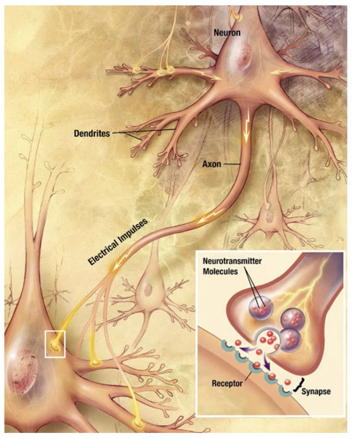
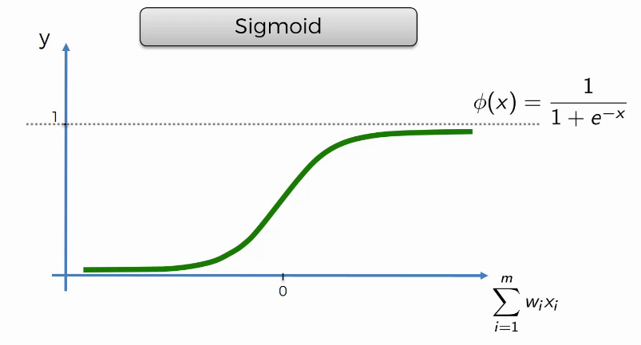
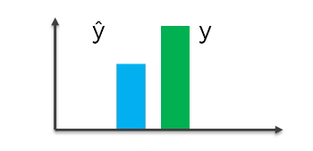

# Apprentissage Profond (Deep Learning)

## Introduction, motivation et contexte

Le désir de créer des machines qui pensent est un désir longtemps souhaité par l'homme. Lorsque les ordinateurs ont été conçus pour la première fois, les gens se sont demandés si ces machines pourraient devenir intelligentes. Mais la grande question est: Comment l'ordinateur peut apprendre de la même façon que nous humains le faisons? Cette question est loin d'être résolue et demeure jusqu'aujourd'hui un sujet de recherche.

Depuis 2006, l'apprentissage profond, ou plus communément appelé apprentissage en profondeur ou apprentissage à réseau neuronal profond, est devenu un nouveau domaine de recherche sur l'apprentissage automatique. Au cours des dernières années, les techniques développées à partir de la recherche sur l'apprentissage profond ont eu un impact sur un large éventail de travaux.

## Pourquoi les réseaux de neurones?

Le cerveau humain n'est pas capable de résoudre des données complexes et ne peut pas extraire d'informations à partir de structures composées. Pour surmonter ce manque de capacité à résoudre des problèmes complexes, Warren McCulloch et Walter Pitts ont proposé un modèle mathématique. Ce modèle est appelé réseaux de neurones artificiels (Artificial Neural Networks en Anglais) qui relève de l'intelligence artificielle. Le réseaux de neurones artificiels est un système informatique conçu pour reproduire la façon dont les humains analysent. Le traitement de plusieurs entrées de données est effectué par différents algorithmes d'apprentissage automatique. Ces algorithmes fonctionnent ensemble dans un cadre unique appelé le réseau neuronal. Les réseaux neuronaux sont inspirés de la structure des réseaux de neurones biologiques dans un cerveau humain.

Le cerveau est complexe; chez les humains, il se compose d'environ 100 milliards de neurones, faisant de l'ordre de 100 000 milliards de connexions. Il est souvent comparé à un autre système complexe qui a un énorme pouvoir de résolution de problèmes: l'ordinateur numérique. Le cerveau et l'ordinateur contiennent tous deux un grand nombre d'unités élémentaires respectivement neurones et transistors, qui sont câblées dans des circuits complexes pour traiter les informations véhiculées par les signaux électriques.

L'ordinateur présente d'énormes avantages par rapport au cerveau en ce qui concerne la vitesse des opérations de base. Aujourd'hui les ordinateurs personnels peuvent effectuer des opérations arithmétiques élémentaires, comme l'addition, à une vitesse de 10 milliards d'opérations par seconde. Nous pouvons estimer la vitesse des opérations élémentaires dans le cerveau par les processus élémentaires par lesquels les neurones se transmettent des informations et communiquent entre eux. Et aussi en terme de précision des opérations de base, l'ordinateur présente d'énormes avantages par rapport au cerveau.

Les réseaux de neurones ont la capacité d'apprendre, de modéliser et de détecter implicitement des relations non linéaires et complexes entre des variables dépendantes et indépendantes, ce qui est vraiment important car dans la vie réelle, bon nombre des relations entre les entrées et les sorties sont non linéaires et complexes.

Tout au long de ce chapitre, nous donnerons une description plus orientée des réseaux de neurones dans le contexte de l'apprentissage profond ainsi que quelques exemples pratiques.

## Définitions

Avant de commencer à décrire les détails de l'apprentissage profond, donnons quelques définitions nécessaires. L'apprentissage en profondeur a diverses définitions ou descriptions étroitement liées.

**Définition 1:**

C'est une classe de techniques d'apprentissage automatique qui exploite de nombreuses couches de traitement de l'information non linéaire pour extraction et transformation d'entités (features) supervisées ou non, et pour l'analyse et la classification de motifs (pattern).

**Définition 2:**

Un sous-domaine de l'apprentissage automatique basé sur les algorithmes d'apprentissage de plusieurs niveaux de représentation afin de modéliser des relations complexes entre les données.

**Définition 3:**

L'apprentissage profond est un ensemble d'algorithmes dans l'apprentissage automatique qui essaie d'apprendre à plusieurs niveaux, correspondant à différents niveaux d'abstraction. Il utilise généralement les réseaux de neurones artificiels.

**Définition 4:**

L'apprentissage profond est un nouveau domaine dans la recherche de l'apprentissage automatique, qui a été introduit dans le but de rapprocher l'apprentissage automatique de l'un de ses objectifs d'origine: l'Intelligence Artificielle. L'apprentissage profond consiste à apprendre plusieurs niveaux de représentation qui aident à donner un sens aux données telles que les images, le son et le texte.

## Réseaux de neurones artificiels

Avant les années 80, la technologie n'était pas à la hauteur pour faciliter la construction des réseaux de neurones due au manque des données en quantité suffisante et des ordinateurs accès puissant pour supporter le calcul tensoriel. Afin que les réseaux de neurones et l'apprentissage profond fonctionnent correctement, nous avons besoin de beaucoup de données et la puissance de traitement et vous avez également besoin d'ordinateurs puissants pour traiter ces données.

**Geoffrey Hinton** est connu comme le parrain de l'apprentissage profond suite à ses travaux remarquables.

:::{div}
:class: center
```{figure} images/JH.png
:name: fig-JH

image
```{width=".45\\linewidth"}
:::

Il a fait des recherches sur l'apprentissage profond dans les années $80$ et a publié plusieurs articles et documents de recherche. Donc, beaucoup de choses dont nous parlerons ici viennent de Geoffrey Hinton. L'idée générale derrière l'apprentissage profond est d'imiter le fonctionnement du cerveau humain qui semble être l'un des outils d'apprentissage les plus puissants sur cette planète et les recherches sont menées pour essayer de faire copier cette architecture par des ordinateurs.

Dans le cerveau humain il y a environ $100$ milliards de neurones et chaque neurone est connecté à environ un millier de ses voisins. Et bien, une structure artificielle appelée réseau de neurones artificiels constitué de noeuds ou neurones et comme valeur d'entrée (input value) nous aurons des neurones et qu'on appellera également couche d'entrée (input layer).

:::{div}
:class: center
```{figure} images/a1.png
:name: fig-a1

image
```{width=".2\\linewidth"}
:::

Ensuite nous avons la valeur de sortie (output) qui est la valeur que nous souhaitons prédire et qui est souvent reliée à la couche de sortie (output layer).

:::{div}
:class: center
```{figure} images/a2.png
:name: fig-a2

image
```{width=".15\\linewidth"}
:::

Et entre les deux, nous avons une couche cachée (hidden layer).

:::{div}
:class: center
```{figure} images/a3.png
:name: fig-a3

image
```{width=".08\\linewidth"}
:::

Comme nous pouvons le constater, dans notre cerveau, nous avons tellement de neurones que certaines informations arrivent par le nez, les yeux,\... et donc essentiellement nos sens, et passent par ces milliards de neurones avant d'arriver à la sortie. Donc le réseau neuronal peut se présenter sous la forme suivante:

:::{div}
:class: center
```{figure} images/a4.png
:name: fig-a4

image
```{width=".5\\linewidth"}
:::

L'on pourrait appeler ceci apprentissage superficiel (shallow learning). Nous parlons d'apprentissage profond lorsque nous le prenons au niveau supérieur c'est-à-dire lorsque nous avons une multitude de couches cachées comme le présente la figure suivante:

:::{div}
:class: center
```{figure} images/a5.PNG
:name: fig-a5

image
```{width=".66\\linewidth"}
:::

Voila donc ce qu'est l'apprentissage profond au niveau très abstrait. Dans la suite, nous allons plonger en profondeur dans l'apprentissage profond.

### Le Neurone

Un neurone artificiel est un point de connexion dans un réseau de neurones artificiels. Le point clé à comprendre ici c'est que les neurones en eux même sont un peu inutiles mais lorsqu'ils sont connectés formant un réseau, ils sont plus utiles et efficaces. Observez les figures suivantes prises sur Wikipédia décrivant les neurones:

:::{div}
:class: center
```{figure} images/a7.PNG
:name: fig-a7

image
```{width=".5\\linewidth"} {width=".25\\linewidth"}
:::

Le neurone est parfois appelé **noeud**

:::{div}
:class: center
```{figure} images/a10.PNG
:name: fig-a10

image
```{width=".5\\linewidth"}
:::

Les valeurs d'entrée sont appelées variables indépendantes et chaque variable peut représenter une observation ou caractéristique qui peut être l'âge d'une personne, le sexe, le compte bancaire, etc.

Les valeurs de sortie peuvent être :

- continues (prix)

- binaires (yes/no)

- catégoriques (pouvant être représentées par plusieurs valeurs de sortie représentant les différentes catégories). Nous pouvons avoir le schéma suivant :

:::{div}
:class: center
```{figure} images/a11.PNG
:name: fig-a11

image
```{width=".5\\linewidth"}
:::

Les synapses ici représentent les poids dénotés par $w_1, w_2, ..., w_m$ qui sont cruciaux pour le fonctionnement du réseau neuronal artificiel

:::{div}
:class: center
```{figure} images/a12.PNG
:name: fig-a12

image
```{width=".55\\linewidth"}
:::

Qu'est ce qui se passe à l'intérieur du neurone?

- 1ère étape: Somme pondérée (weighted sum) de toutes les valeurs d'entrée

  $$\sum_{i=1}^{m} w_i x_i$$

- 2ème étape: Appliquer la fonction d'activation $\phi$

  $$\phi\left( \sum_{i=1}^{m} w_i x_i \right)$$

  Dans la section qui suit nous présenterons quelques fonctions d'activation souvent utilisé en pratique.

- 3ème étape: Selon la fonction, le neurone transmettra le signal ou pas. A l'étape 3, le neurone transmet le signal au neurone suivant

:::{div}
:class: center
```{figure} images/a13.PNG
:name: fig-a13

image
```{width=".65\\linewidth"}
:::

### La fonction d'activation

La fonction d'activation est utilisée afin de faire les connexions entre les différentes couches cachées d'un réseau de neurones ou avoir la sortie d'un neurone. C'est une fonction non-linéaire utilisée pour transformer la sortie de chaque noeud d'une couche avant d'être utiliser comme entrée à la couche suivante. Comme appliquée à l'étape 2, la fonction d'activation $\phi(.)$ est appliquée à la somme pondérée des valeurs d'entrée pour évaluer la sortie $y$ du neurone. En général, la fonction d'activation est une fonction non-linéaire monotone croissante et elle peut être déterministe, continue, discontinue ou aléatoire. Son choix dépend de l'application (type de problème à résoudre) par exemple, s'il faut avoir une sortie binaire (0 ou 1) c'est la fonction sigmoïde qui est utilisée.

Il existe plusieurs fonctions d'activation parmi lesquelles quatre types (les plus courantes) seront examinées dans ce cours.

#### La fonction de seuil (Threshold function)

Voici comment est définie la fonction de seuil: sur l'axe des abscisses, nous avons la somme pondérée des valeurs d'entrées et sur l'axe des ordonnées nous avons les valeurs comprises entre 0 et 1. Très semblable à un type de fonction rigide, oui ou non.

:::{div}
:class: center
```{figure} images/a14.PNG
:name: fig-a14

image
```{width=".55\\linewidth"}
:::

#### La fonction Sigmoïde (Sigmoid function)

C'est une fonction qui est utilisée dans la régression logistique {ref}`ch2` . Voici à quoi elle ressemble:


<div class="center">

</div>


#### La fonction de redressement (Rectifier en Anglais)

La fonction de redressement est l'une des fonctions les plus populaires pour les réseaux de neurones artificiels. Elle est plus couramment utilisé que la fonction sigmoïde à cause de sa simplicité dans le calcul. Voici à quoi elle ressemble:

:::{div}
:class: center
```{figure} images/a16.jpg
:name: fig-a16

image
```{width=".6\\linewidth"}
:::

Elle est nulle, $\forall x \leq 0$ et évolue de manière croissante pour tout $x \ge 0$. Nous verrons comment utiliser cette fonction dans la partie pratique du cours.

#### La fonction tangente hyperbolique. (Hyperbolic Tangent (tanh))

En termes de comportement (forme des courbes) elle est similaire à la fonction sigmoïde mais la grande différence est au niveau de leurs ensembles images et de la vitesse de leurs courbes respectives.

Nous n'allons pas aller en profondeur sur chacune de ces fonctions, nous voulions juste vous les décrire brièvement afin que vous sachiez à quoi elles ressemblent.

:::{div}
:class: center
```{figure} images/a17.png
:name: fig-a17

image
```{width=".6\\linewidth"}
:::

**Note** Différentes couches peuvent avoir différentes fonctions d'activations en fonction de la sortie qu'on veut avoir.

**Exemples d'application**

Illustrons pour commencer, le fonctionnement interne d'un réseau neuronal à un seul neurone. Supposant que la variable dépendante est binaire $(y=0$ ou $1)$; quelle fonction d'activation utiliserez-vous parmi celles décrites plus haut?

**Réponse:** Il y a deux options avec lesquelles nous pouvons aborder cela. L'une est la fonction d'activation du seuil et l'autre et la fonction d'activation sigmoïde car elles ont des valeurs de sortie comprise entre 0 et 1.

:::{div}
:class: center
```{figure} images/q2.PNG
:name: fig-q2

image
```{width=".6\\linewidth"}
:::

La {ref}`fig-example2` représente aussi un exemple où nous appliquons la fonction d'activation du redresseur. À partir de là, les signaux sont transmis à la couche de sortie où la fonction d'activation sigmoïde serait appliquée et ce serait notre sortie finale. Cela pourrait prédire une probabilité par exemple, donc cette combinaison va être assez courante là où dans les couches cachées, nous appliquons la fonction de redressement puis, nous appliquons la fonction sigmoïde pour la couche de sortie.

```{figure} images/q3.png
:name: fig-example2
:alt: Application de la fonction d’activation dans un neurone.

Application de la fonction d’activation dans un neurone.
```


### Comment fonctionne le réseau de neurone?

Nous allons examiner un exemple réel de la façon dont un réseau neuronal peut être appliqué et nous allons travailler étape par étape à travers le processus de son application afin que nous sachions ce qui se passe. Nous n'allons pas entraîner le réseau ici qui est une petite clarification car une étape très importante des réseaux de neurones est leur entraînement et nous allons voir cela un peu plus loin.

Pour l'instant, nous allons nous concentrer sur les applications réelles, nous travaillerons avec un réseau neuronal que nous allons supposer être déjà entraîné et qui nous permettra de nous concentrer sur la côté application des choses. Disons donc que nous avons des variables d'entrée:

- Superficie (en $km^2$ carrés),

- Chambres (nombre de chambre),

- Distance (entre deux villes en $km$),

- Âge

Tous ces quatre vont constituer la couche d'entrée qui sont les paramètres qui définissent le prix d'une propriété.

```{figure} images/a18.PNG
:name: fig-tresbasique


```


La {ref}`fig-tresbasique` représente un réseau de neurones qui n'a qu'une couche d'entrée et une couche de sortie, donc pas de couches cachées. Notre couche de sortie est le prix que nous voulons prédire; il pourrait être calculé par la somme pondérée de toutes les entrées. De manière optionnelle nous pouvons appliquer à ce réseau une fonction d'activation qui nous permettra d'avoir de résultat de sortie positive.

L'avantage que nous avons avec les réseaux de neurones, est la flexibilité et la puissance, d'où l'augmentation de la précision. Ce pouvoir réside en fait sur le nombre des couches cachées et nous allons comprendre pourquoi.

### Comment les réseaux de neurones apprennent?

Maintenant que nous savons ce que c'est qu'un réseau de neurones, découvrons comment ils apprennent. Il existe deux approches fondamentalement différentes pour créer un programme informatique:

D'une part, le codage (programmation traditionnelle), où nous disons explicitement les règles spécifiques du programme et quels résultats nous voulons.

D'autre part, nous avons des réseaux de neurones où nous créons une architecture pour que le programme puisse comprendre ce qu'il doit faire par lui-même. Donc, nous créons essentiellement ce réseau neuronal où nous avons fourni des entrées, nous lui disons ce que nous voulons comme sorties, puis nous le laissons tout comprendre par lui-même.

Dans ce cours nous nous focaliserons sur la deuxième approche qui consiste à créer ce réseau qui apprend par lui-même.

Considérons un réseau neuronal très basique avec une seule couche ( encore appelé réseau neuronal à action directe à une seule couche) appelé \"perceptron\".

Le perceptron a été inventée pour la première fois en 1957 par *Frank Rosenblatt*. L'idée était de créer quelque chose qui peut réellement apprendre et s'ajuster.

:::{div}
:class: center
```{figure} images/a26.jpg
:name: fig-a26

image
```{width=".2\\linewidth"}  
:::

**Apprentissage d'un perceptron:**

Considérons des valeurs d'entrées qui ont été fournies au perceptron comme l'illustre la {ref}`fig-perce`. En premier lieu, nous allons faire une combinaison linéaire de ces valeurs d'entrées avec leurs poids respectifs. Ensuite nous appliquons la fonction d'activation (par exemple la fonction sigmoïde) sur cette combinaison linéaire, nous obtenons une valeur de sortie $\hat{y}$.

```{figure} images/a25.png
:name: fig-perce
:alt: perceptron

perceptron
```


Pour évaluer la performance de notre réseau, nous effectuons une sorte de comparaison entre la valeur réelle et la valeur de sortie du réseau. Cette comparaison peut se faire à travers la fonction $C$ ci-dessous, appelée fonction de perte (loss function).

$$\begin{equation}
 \label{function:C}
     C(\hat{y})=\frac{1}{2}(\hat{y}-y)^T(\hat{y}-y)
\end{equation}$$



<figcaption>Visualisation de la différence entre la valeur réelle et la valeur prédite lorsque le modèle n’est pas encore suffisamment entraîné.</figcaption>


Il existe de nombreuses fonctions de coût différentes que nous pouvons utiliser. Nous utiliserons la fonction définie dans l'équation {eq}`function:C` pour illustrer le processus d'apprentissage automatique. La fonction de coût mesure l'erreur de prédiction de notre réseau de neurone. Notre objectif est donc de minimiser la fonction de coût, car plus la fonction de coût est faible, plus la valeur prédite $\hat{y}$ est proche de la vraie valeur $y$.

Une fois que nous avons notre fonction de coût, qui nous a permis de comparer la valeur de sortie et la valeur réelle, nous allons réinjecter ces informations dans le réseau neuronal et ces informations retournent jusqu'aux poids qui sont mis à jour comme nous le voyons sur la figure ci-dessous:

:::{div}
:class: center
```{figure} images/a282.png
:name: fig-a282

image
```{width=".5\\linewidth"}
:::

Fondamentalement, la seule chose dont nous avons le contrôle dans le réseau neuronal sont les poids $w_1, w_2, ...w_m$. Nous mettons donc à jour les poids et les ajustons.

Nous entrons à nouveau nos valeurs d'entrées avec les poids mis a jours et nous obtenons un nouveau $\hat{y}$ et donc $C$ comme le montre le schéma suivant

:::{div}
:class: center
```{figure} images/a291.png
:name: fig-a291

image
```{width=".52\\linewidth"}
:::

Nous répétons la même chose toujours en entrant les mêmes valeurs et nous remarquons qu'à chaque fois les valeurs de $\hat{y}$ et $C$ changent

:::{div}
:class: center
```{figure} images/a301.png
:name: fig-a301

image
```{width=".52\\linewidth"}
:::

Nous arrêterons au point où la valeur de $\hat{y}$ est proche de $y$, le cas parfait serait si $\hat{y}=$ c'est à dire la fonction de coût est nulle.

:::{div}
:class: center
```{figure} images/a311.png
:name: fig-a311

image
```{width=".52\\linewidth"}
:::

Habituellement, l'on n'obtiendra pas une fonction de coût égale à zéro, ceci est un exemple très simple pour essayer de comprendre comment ça marche.

Dans le cas où nous avons en entrée plusieurs points de données, l'erreur de prédiction du modèle sur cet ensemble de données est la moyenne arithmétique des erreurs de prédiction sur chacun des points de l'ensemble.

$$C=\sum_{i=1}^{n} \frac{1}{2n}(\hat{y_i}-y_i)^2$$

Une fois que nous avons la fonction de coût globale, nous revenons en arrière comme décrit plus haut, et mettons les poids à jour. Ce processus est appelé rétropropagation (Back propagation) que nous allons expliquer clairement plus loin.

### Descente graduelle (Gradient Descent)

Dans cette section nous expliquerons exactement comment les poids sont ajustés lors de l'entraînement d'un réseau de neurone.

Considérons donc notre perceptron,

:::{div}
:class: center
```{figure} images/a32.png
:name: fig-a32

image
```{width=".52\\linewidth"}
:::

Eh bien, une approche pour le faire est une approche par force brute où nous prenons simplement toutes sortes de poids possibles et nous regardons lequel semble être le meilleur et ce que nous faisons, par exemple, nous essaierions un millier de poids et nous traçons la fonctions de coût $C$ en fonction de la valeur de sortie $\hat{y}$ Voici à quoi ressemblerait la fonction de coût :

:::{div}
:class: center
```{figure} images/a33.PNG
:name: fig-a33

image
```{width=".42\\linewidth"}
:::

et fondamentalement, nous trouverons le meilleur valeur comme indiquée par la flèche. Nous faisons parfois face à un problème de dimensionnement. Considérons le simple réseau neuronal ci-après:

:::{div}
:class: center
```{figure} images/a34.PNG
:name: fig-a34

image
```{width=".42\\linewidth"}
:::

Nous avons $25$ poids = $4*5 + 5*1 = 25$ (sans considérer les interceptes). Cela signifie donc que si nous cherchons ces $25$ poids parmi seulement $1000$ valeurs, il y aura $1000^{25}=10^{75}$ possibilités. Même sur le super-calculateur le plus rapide au monde, ne peut pas effectuer cette opération nous devons donc trouver une approche différente, pour trouver le poids optimal. Au fait, notre réseau de neurones était très simple, que se passerait-il si les réseaux de neurones étaient un peu plus compliqués? C'est à dire ressemblant à quelque chose comme ceci.

:::{div}
:class: center
```{figure} images/a35.PNG
:name: fig-a35

image
```{width=".62\\linewidth"}
:::

Nous allons faire un rappel de la méthode de la descente de gradient dans le contexte d'un réseau neuronal.

Une transformation formalisée de base qui décrit la règle de mise à jour de la descente du gradient, comme nous l'avons vu plus haut est:

$$\begin{equation}
 \label{trans}
\omega \longleftarrow \omega - \alpha \cdot \nabla_\omega C
\end{equation}$$

L'équation {eq}`trans` est effectuée à chaque itération sur $\omega$ et est composée de:

- la matrice de poids $\omega$,

- la fonction de perte $C$,

- le taux d'apprentissage $\alpha$,

- le gradient de la fonction de perte $\nabla_{\omega} C$

À partir de la matrice poids $\omega$, on soustrait le gradient de la fonction de perte par rapport aux poids ($\nabla_\omega C$) multiplié par le taux d'apprentissage ($\alpha$). Le gradient est une matrice (ou un vecteur) qui nous donne la direction dans laquelle la fonction de perte a la montée la plus rapide (le signe moins est dû à la direction opposée au gradient que nous devons prendre).

### Descente graduelle stochastique (Stochastic Gradient Descent SGD)

Il pourrait arriver que la fonction de perte ne soit pas convexe par rapport aux paramètres du réseau neuronal et que l'on ait l'allure présentée dans la {ref}`fig-my_label1`.

```{figure} images/a36.PNG
:name: fig-my_label1
:alt: Fonction de pertes non convexe par rapport aux paramètres du réseau.

Fonction de pertes non convexe par rapport aux paramètres du réseau.
```


Que se passerait-il dans ce cas si nous essayions simplement d'appliquer la méthode de descente de gradient normale? Nous pourrions trouver un minimum local de la fonction de perte plutôt qu'un minimum global qui est le meilleur comme indiqué sur la {ref}`fig-my_label1`. Nous n'aurions pas le poids (du réseau) optimal, ce qui conduit à un réseau neuronal non-optimisé. Ce que nous faisons dans ce cas est d'utiliser la descente graduelle stochastique qui par chance, peut vite converger vers la solution optimale.

La descente graduelle stochastique est un peu différente, nous prenons les points de données un par un de manière aléatoire. Nous prenons un point de données, nous exécutons notre réseau de neurones, examinons la fonction de coût, puis nous ajustons les poids et réitérons le processus jusqu'à la convergence. Donc, fondamentalement, nous cherchons à ajuster les poids après chaque point au lieu d'attendre de parcourir tous les points de données. De ce fait, descente graduelle stochastique est plus rapide (au niveau de la mise à jour de poids) que la descente graduelle encore appelée descente graduelle en collection (Batch Gradient Descent).

### Rétropropagation (Backpropagation)

Pour parler de rétropropagation, nous devons au préalable introduire la notion de propagation vers l'avant. La propagation vers l'avant est un processus ou les informations sont introduite dans la couche d'entrée, puis propagées vers l'avant pour obtenir la valeur de sortie: c'est le phénomène dit \"forward pass\". Ces valeurs de sortie sont ensuite comparées aux valeurs rélles et ceci en utilisant une fonction (fonction de perte) dépendant des poids du réseau. Donc l'idée ici est de comparer ces valeurs aux valeurs réelles, et ensuite d'évaluer les erreurs qui sont propagées a travers le réseau dans la direction opposée. Donc, la chose importante à retenir ici est que la propagation arrière ou rétropropagation est un algorithme avancé qui nous perme. d'ajuster les poids simultanément. En effet, un réseau de neurones n'est autre qu'une **composition de fonctions paramétrées** et comme nous l'avons vu dans l'algorithme de la descente du gradient stochastique, l'objectif est de faire à chaque fois la mise à jour des poids $w$. Il est essentiellement question d'évaluer le gradient de la fonction de perte en fonction des paramètres $w$. Pour cela, étant donné que les dérivées sont inter-dépendantes les unes des autres, l'idée est de trouver une stratégie de les calculer en tirant profit de cette dépendance: d'où le but de l'algorithme de rétropropagation qui permet fondamentalement de calculer ces dérivées ou gradients en évitant les redondances par l'astuce de la règle de dérivation en chaîne (\"chain rule\") bien connu en mathématiques notamment en calcul différentiel.

Pour illustrer le processus de rétropropagation, considérons un simple réseau de neurones constitué de deux couches (une couche intermédiaire et une couche de sortie) défini comme:

$$\begin{equation}
 \label{rn}
    x\longrightarrow f(x) \longrightarrow g(z)\longrightarrow \ell(g(z), y)
\end{equation}$$

- Avec $z = f(x)$ et $y$ valeur réelle.

Ce réseau de neurones {eq}`rn` comprend deux paramètres $W_{1}$ pour la couche intermédiaire et $W_2$ pour celle de sortie. Pour éffectuer la mise à jour de ces paramètres, nous dévons calculer:

- $\nabla_{W_1}\ell(g(z),y)$

- $\nabla_{W_2}\ell(g(z),y)$

Pour calculer ces dérivées, nous allons utiliser le \"chain rule\" comme suit:

$$\begin{align}
    \nabla_{W_2}\ell(g(z),y) = \frac{\partial \ell }{\partial g} \frac{\partial g}{\partial W_2}.
\end{align}$$

$$\begin{align}
   \nabla_{W_1}\ell(g(z),y) = \frac{\partial \ell}{\partial g}\frac{\partial g}{\partial f} \frac{\partial f}{\partial W_1}.
\end{align}$$

Maintenant, nous allons tout résumer avec une procédure pas à pas de ce qui se passe dans l'entraînement d'un réseau neuronal.

**Étape 1** Initialiser à zéros ou de manière aléatoire les poids en petits nombres proches de zéro (conseillé).  
**Étape 2** Entrer une vague d'observations de l'ensemble de données sur la couche d'entrée  
**Étape 3** Propagation vers l'avant: de gauche à droite, les neurones sont activés de telle sorte que l'impact de l'activation de chaque neurone est limité par les poids. Propager les activations jusqu'à obtenir le résultat prédit $\hat{y}$.  
**Étape 4** Comparer le résultat prédit à la valeur réelle. Mesurer l'erreur générée.  
**Étape 5** Rétropropagation: de droite à gauche, l'erreur est propagée en arrière. Mettre à jour les poids. Le taux d'apprentissage décide de combien nous mettons à jour les poids.  
**Étape 6** Répéter les étapes **1** à **5** et mettre à jours les poids après chaque vague d'observations jusqu'au point de convergence décidé.

N.B : On parle généralement du terme \"epoch\" quand tout l'ensemble d'entraînement passe à travers le réseau neuronal artificiel, empiriquement le nombre d'epoch est considéré souvent comme un critère d'arrêt.

## Réseaux de neuronnes adaptés au traitement de séquences

### Introduction

Les architectures des réseaux de neurones discutées dans le chapitre précédent sont intrinsèquement conçues pour les données multidimensionnelles dans lesquelles les attributs sont largement indépendants les uns des autres. Cependant, certains types de données tels que les séries temporelles ou chronologiques, les textes et les données biologiques contiennent des dépendances séquentielles entre les attributs. Des exemples de telles dépendances sont les suivants:

- Bien que les textes soient souvent traités comme un sac de mots (bag of words en anglais), mais pour avoir une meilleure sémantique les mots doivent être utilises dans l'ordre de leurs apparitions dans la phrase. Dans de tels cas, il est important de construire des modèles qui prennent en compte les informations en séquence. Les données textuelles sont les cas d'utilisation le plus courant des réseaux de neurones récurrents (RNR).

- Les données biologiques contiennent souvent des séquences dans lesquelles les symboles peuvent correspondre aux acides aminés ou l'un des nucléotides qui forment les éléments constitutifs de l'ADN (Acide Désoxyribonucléique).

- Dans les données en séries temporelles ou chronologiques, les valeurs des horodatages successifs sont étroitement liées les unes aux autres. Si l'on utilise les valeurs de ces horodatages comme caractéristiques indépendantes, les informations clés sur les relations entre les valeurs de ces horodatages sont perdues.

Un des problèmes rencontré dans l'utilisation des réseaux de neurones classiques sur les données textes est la variabilité de la taille des valeurs d'entrées. Ils souffrent aussi du problème de grand nombre de paramètres. Ces quelques problèmes soulevés sont résolus par les réseaux de neurones récurrents.  
Dans un RNR, il existe une correspondance bijective entre les couches dans le réseau et les positions spécifiques dans la séquence. La position dans la séquence est également appelée son horodatage. Par conséquent, au lieu d'un nombre variable d'entrées dans une couche d'entrée unique, le réseau contient un nombre variable de couches, et chaque couche a une entrée unique correspondant à cet horodatage. Par conséquent, les entrées sont autorisées à interagir avec les couches cachées en aval en fonction de leur position dans la séquence. Chaque couche utilise les même paramètres pour assurer une modélisation similaire à chaque horodatage, et par conséquent, le nombre de paramètres est également fixe.

### Architecture de Réseaux de Neurones Récurrents (RNR)

Dans ce qui suivra nous utiliserons une architecture basique de RNR. Malgré que le RNR est utilisé sur presque toutes les données séquentielles, nous supposerons l'utilisation sur les textes tout au long de cette section afin de permettre des explications intuitivement simples de divers concepts.

::::{grid} 1 1 2 2
:gutter: 2

:::{grid-item-card}
```{figure} images/CNN&RNN/rnn_fold.png
:name: fig-rnn_fold
:width: 100%

RNR compact
```
:::

:::{grid-item-card}
```{figure} images/CNN&RNN/rnn_unfold.png
:name: fig-rnn_unfold
:width: 100%

RNR déroulé
```
:::

::::


La {ref}`fig-rnn_fold` est une simple illustration du RNR. Un point clé ici est la présence de la boucle sur la {ref}`fig-rnn_fold`, cela va changer la valeur de l'état interne du RNR correspondant à chaque mot de la séquence. En pratique, on ne travaille qu'avec des séquences de longueur finie, et il est logique de déplier la boucle du RNR «en couches temporelles» qui ressemble plus à un réseau de neurone traditionnel comme illustré dans la {ref}`fig-rnn_unfold` ($t=1,\dots, 4$). En pratique, il existe plusieurs types d'architectures pour résoudre différents problèmes comme illustré à la {ref}`fig-rnn_arch`. Par exemple, l'architecture de la {ref}`fig-rnn` est dédiée à la modélisation du langage. En effet, un modèle de langage est un concept bien connu dans le traitement du langage naturel qui prédit le prochain mot, étant donné les mots précédents dans leur ordre dans la séquence d'entrée.

```{figure} images/CNN&RNN/rnn_architectures.PNG
:name: fig-rnn_arch
:alt: Différentes sortes d’architectures du RNR.

Différentes sortes d’architectures du RNR.
```


En général, le vecteur d'entrée au temps $t$ (par exemple, un vecteur codé sous le one-hot-encoding du $t$-ème mot) est $x_t$, l'état interne au temps $t$ est $h_t$, et le vecteur de sortie au temps $t$ (par exemple, les probabilités prédites du $(t + 1)$-ème mot) est $y_t$. $x_t$ et $y_t$ sont tous deux de dimension $d$ pour un lexique de taille $d$. Le vecteur interne $h_t$ est $p-$dimensionnel, où $p$ régule la complexité du embedding. L'état interne au temps $t$ est donné par une fonction qui prend en paramètre le vecteur d'entrée au temps $t$ et le vecteur interne au temps $t-1$:

$$\begin{equation}
    h_t = f(h_{t-1}, x_t)
    \label{eqn:h_t}
\end{equation}$$

Cette fonction est définie à l'aide de matrices de poids et de fonctions d'activation (telles qu'utilisées par tous les réseaux de neurones pour l'apprentissage), et les mêmes poids sont utilisés à chaque horodatage (timestamp). Par conséquent, même si l'état interne évolue au fil du temps, les poids et la fonction sous-jacente $f(\cdot, \cdot)$ restent fixes sur tous les horodatages (c'est-à-dire les éléments séquentiels) après que le réseau de neurone ait été entraîné. Une fonction distincte $y_t = g(h_t)$ est utilisée pour apprendre les probabilités en sortie des états internes. À titre illustratif, considérons une matrice entrée-interne $\mathbf{W}_{xh}$ de dimension $p\times d$, une matrice interne-interne $\mathbf{W}_{hh}$ de dimension $p\times p$, et une matrice interne-sortie $\mathbf{W}_{hy}$ de dimension $d\times p$. Ainsi, on peut écrire l'équation {ref}`eqn:h_t` comme suit: $$h_t = \operatorname{tanh}(\mathbf{W}_{xh}x_t + \mathbf{W}_{hh}h_{t-1}),$$

et la condition de sortie comme: $$y_t = \operatorname{Softmax}\left(\mathbf{W}_{hy}h_t\right).$$

### Rétro-propagation à travers le temps

Contrairement aux réseaux de neurones traditionnels, les réseaux de neurones récurrents sont entraînés en utilisant un type d'algorithme spécialisé appelé la rétro-propagation à travers le temps (voir [wikipedia](https://en.wikipedia.org/wiki/Backpropagation_through_time) pour plus d'information). Les étapes de l'algorithme sont les suivants:

1.  Exécutions séquentielle de l'entrée dans le sens direct à travers le temps et calcul des erreurs à chaque horodatage.

2.  Calcul des gradients par rapport aux poids de la droite vers la gauche du réseau déployé sans tenir compte du fait que les poids des différentes couches sont partagés. En d'autres termes, on suppose que les poids $\mathbf{W}^{(t)}_{xh}$, $\mathbf{W}^{(t)}_{hh}$ et $\mathbf{W}^{(t)}_{hy}$ dans horodatage $t$ sont distincts des autres horodatages. En conséquence, on peut utiliser la rétro-propagation conventionnelle pour calculer $\dfrac{\partial L}{\partial \mathbf{W}^{(t)}_{xh}}$, $\dfrac{\partial L}{\partial \mathbf{W}^{(t)}_{hh}}$, et $\dfrac{\partial L}{\partial \mathbf{W}^{(t)}_{hy}}$.

3.  On additionne tous les poids (partagés) correspondant aux différentes instanciations d'une arête dans le temps. En d'autres termes, nous avons les éléments suivants: $$\dfrac{\partial L}{\partial \mathbf{W}_{xh}} = \sum^T_{t=1} \dfrac{\partial L}{\partial \mathbf{W}^{(t)}_{xh}}$$

$$\dfrac{\partial L}{\partial \mathbf{W}_{hh}} = \sum^T_{t=1} \dfrac{\partial L}{\partial \mathbf{W}^{(t)}_{hh}}$$

$$\dfrac{\partial L}{\partial \mathbf{W}_{hy}} = \sum^T_{t=1} \dfrac{\partial L}{\partial \mathbf{W}^{(t)}_{hy}}$$

Les dérivations ci-dessus découlent d'une application simple de la règle de la composition multivariée.

### Les Challenges dans l'entraînement des RNR

```{figure} images/CNN&RNN/grad_vanishing.png
:name: fig-grad_van
:alt: Problèmes d’annulation et d’explosion du gradient.

Problèmes d’annulation et d’explosion du gradient.
```


Le principal défi associé à un réseau de neurone récurrent est celui des problèmes d'annulation et d'explosion du gradient.  
Considérons une séquence de longueur $T$ pour laquelle, dans le processus d'entraînement, l'on applique la fonction d'activation $\Phi = \tanh$ entre chaque paire d'états intermédiaires. Le poids partagé entre une paire de nœuds internes (cachés) est noté $w$. Soient $h_1 \cdot \cdot \cdot h_T$ et $\Phi^{\prime}(h_t)$ les différents états intermédiaires et la valeur de la fonction dérivée en $h_t$ respectivement. Supposons que la copie du poids partagé $w$ dans le $t-$ième état intermédiaire soit désignée par $w_t$. La dérivée de la fonction de coût par rapport à $h_t$ est donnée par:

$$\begin{align}
    \dfrac{\partial L}{\partial h_t} = \dfrac{\partial L}{\partial h_{t+1}}\dfrac{\partial h_{t+1}}{\partial h_{t}}.
\end{align}$$

Comme $h_{t+1} = \Phi \circ g(x_{t+1},h_t)$, ($g(x_{t+1}, h_t)=w_{xh}x_{t+1} + w_{t+1}h_{t}$), on a:

$$\begin{align}
    \dfrac{\partial L}{\partial h_t} = \dfrac{\partial}{\partial h_t}\left[\Phi \circ g(x_{t+1},h_t)\right]\dfrac{\partial L}{\partial h_{t+1}},
\end{align}$$

où,

$$\begin{equation*}
    \dfrac{\partial}{\partial h_t}\left[\Phi \circ g(x_{t+1},h_t)\right] = \Phi^{\prime}(g(x_{t+1},h_t))\cdot w_{t+1}.
\end{equation*}$$

Donc, les équations de mise à jour sont données par:

$$\begin{equation}
    \dfrac{\partial L}{\partial h_t} = \Phi^{\prime}(g(x_{t+1},h_t))\cdot w_{t+1}\cdot \dfrac{\partial L}{\partial h_{t+1}}.
\end{equation}$$

Puisque les poids partagés dans les différentes couches temporelles sont les mêmes, le gradient est multiplié par la même quantité $w_t = w$ pour chaque couche. Une telle multiplication aura un biais cohérent vers la disparition du gradient lorsque $w<1$, et il aura un biais cohérent vers l'explosion du gradient lorsque $w>1$. Cependant, le choix de la fonction d'activation jouera également un rôle car la dérivée $\Phi^{\prime}(h_{t+1})$ est inclus dans le produit.

### Long Short-Term Memory (LSTM)

Comme discuté dans la section précédente, les RNR font face aux problèmes d'annulation et d'explosion des gradients. Pour résoudre ces problèmes, une solution consiste à modifier l'équation de récurrence pour le vecteur caché avec l'utilisation de la mémoire à long terme. Le LSTM est une amélioration de l'architecture de RNR dans laquelle nous modifions les conditions de récurrence de la façon dont les états cachés $h^{<t>}$ sont propagés. Afin d'atteindre cet objectif, nous avons un vecteur caché supplémentaire de dimension $p$, qui est désigné par $C^{<t>}$ et appelé \"l'état cellule\". L'état cellule peut être vu comme une sorte de mémoire à long terme qui conserve systématiquement les informations des états antérieurs en utilisant une combinaison d'opérations partielles «d'oubli» et «d'incrémentation» sur les états précédents. Dans ce cas, les mises à jour utilisent quatre variables vectorielles intermédiaires $p$-dimensionnelles $i$, $f$, $o$, et $c$. Les variables intermédiaires $i$, $f$ et $o$ sont respectivement appelées variables d'entrée, d'oublie et de sortie, pour les rôles qu'ils jouent dans la mise à jour des états cellules et des états cachés.

```{figure} images/CNN&RNN/lstm.png
:name: fig-lstm
:alt: Architecture de LSTM.

Architecture de LSTM.
```


Les variables intermédiaires sont définies comme suit:

$$\begin{equation}
  \begin{cases}
    f_t = \sigma\Big( \mathbf{W}_{fx}x^{<t>} + \mathbf{W}_{h}x^{<t-1>} + b_f \Big)\\
    i_t = \sigma\Big( \mathbf{W}_{ix}x^{<t>} + \mathbf{W}_{ih}x^{<t-1>} + b_i \Big)\\
    g_t = \tanh \Big( \mathbf{W}_{gx}x^{<t>} + \mathbf{W}_{gh}x^{<t-1>} + b_g \Big)\\
    o_t = \sigma\Big( \mathbf{W}_{ox}x^{<t>} + \mathbf{W}_{oh}x^{<t-1>} + b_o \Big)
  \end{cases}
\end{equation}$$

L'équation de la mise à jour de l'état cellule en utilisant les variables intermédiaires est la suivante: $$\begin{equation}
    C^{<t>} = \Big(C^{<t>} \odot f_t \Big) \oplus \Big ( i_t \odot g_t \Big )
\end{equation}$$

Finalement, l'état caché est mis à jour de la manière suivante: $$\begin{equation}
    h^{<t>} = o_t \odot \tanh \Big ( C^{<t>} \Big )
\end{equation}$$

## Réseaux de neurones en couches convolutionnelles

Les réseaux convolutifs également connus sous le nom de réseaux neuronaux convolutionnels, sont un type spécialisé de réseau neuronal pour le traitement de données en grille. Par exemple les images qui sont considérées comme des données $2$-D composées de pixels, les données de séries temporelles qui peuvent être vues comme des données $1$-D prises a un intervalle de temps régulier. L'opération mathématique de base utilisée dans ces type de réseaux est appelée \"convolution\".

### Architecture du Réseaux de neurones en couches convolutionnelles (en abrégé CNN, i.e, Convolution Neural Network en anglais)

Un réseau neuronal convolutif se compose d'une couche d'entrée et d'une couche de sortie, ainsi que des couches intermédiaires. La couche intermédiaire est composée de plusieurs couches de convolutions, chacune avec plusieurs canaux (channels en Anglais) qui sont vus comme une superposition de convolutions. En effet, en ce qui est de la construction du modèle CNN, la fonction d'activation généralement utilisée est la fonction ReLU (Rectified Linear Unit). La fonction d'activation pourrait être ensuite suivie par des convolutions supplémentaires telles que des couches de regroupement (pooling), qui à leur tour sont nécessairement suivies par des couches entièrement connectées. Bien que les couches soient communément appelées convolutions, ce n'est que par convention. Mathématiquement, il s'agit techniquement d'un produit scalaire glissant ou d'une corrélation croisée.

:::{div}
:class: center
```{figure} images/LeNet.png
:name: fig-LeNet

image
```{width=".5\\linewidth"}
:::

### L'opération de convolution

Le but principal de la convolution dans le cas d'un CNN est d'extraire des caractéristiques de l'image d'entrée. La convolution préserve la relation spatiale entre les pixels en apprenant les caractéristiques de l'image à l'aide de petites portions de données d'entrée. Cette opération est définie formellement comme suit: Supposons $I$ une image $2D$ comme entrée et $K$ un filtre $2D$ $$\begin{equation}
        \mathbf{F}(i,j) = (\mathbf{K}* \mathbf{I})(i,j) = \sum_m \sum_n \mathbf{I}(i-m, j-n)\mathbf{K}(m, n)
\end{equation}$$

Maintenant essayons de voir comment cela marche concrètement avec les images. Considérons une image blanc sur noir de dimension $5 \times 5$ dont les valeurs de pixels ne sont que des 0 et des 1 (notez que pour une image en couleur, les valeurs de pixels vont de 0 à 255, la matrice verte ci-dessous est un cas particulier où les valeurs de pixels ne sont que des 0 et des 1):  

```{figure} images/mat5x5.png
:name: fig-mat5x5
:alt: Image de dimension 5 \times 5

Image de dimension <span class="math inline">5 × 5</span>
```


Considérez également une autre matrice filtre de dimension $3 \times 3$ comme indiqué dans la {ref}`fig-filter3x3`

```{figure} images/filter3x3.png
:name: fig-filter3x3
:alt: Filtre de dimension 3 \times 3

Filtre de dimension <span class="math inline">3 × 3</span>
```


Pour illustration, nous faisons glisser la matrice orange {ref}`fig-filter3x3` sur notre image d'origine {ref}`fig-mat5x5` d'un pas de 1 pixel (appelée stride en Anglais, représentant le pas de glissement), et pour chaque position, nous calculons la multiplication élément par élément (entre les deux matrices) et ajoutons les sorties de multiplication pour obtenir un nombre final qui forme un élément unique de la matrice de sortie (rose) comme illustré dans la {ref}`fig-convolution_process`. Notons que la matrice $3 \times 3$ ne «voit» qu'une partie de l'image d'entrée à chaque stride.  

::::{grid} 1 1 4 4
:gutter: 1

:::{grid-item}
```{figure} images/Gifs-0.png
:name: fig-convolution_process
:width: 100%

Illustration de la convolution d’un filtre sur une image.
```
:::

:::{grid-item}
```{figure} images/Gifs-1.png
:width: 100%


```
:::

:::{grid-item}
```{figure} images/Gifs-2.png
:width: 100%


```
:::

:::{grid-item}
```{figure} images/Gifs-3.png
:width: 100%


```
:::

:::{grid-item}
```{figure} images/Gifs-4.png
:width: 100%


```
:::

:::{grid-item}
```{figure} images/Gifs-5.png
:width: 100%


```
:::

:::{grid-item}
```{figure} images/Gifs-6.png
:width: 100%


```
:::

:::{grid-item}
```{figure} images/Gifs-7.png
:width: 100%


```
:::

:::{grid-item}
```{figure} images/FEATURE_MAP.png
:width: 100%


```
:::

::::


Dans la terminologie CNN, la matrice $3 \times 3$ est appelée un \"filtre\" ou un \"noyau\" et la matrice formée en faisant glisser le filtre sur l'image et en calculant le produit scalaire est appelée la \"Feature Map\" (\"Convolved Feature\" sur l'image). Il est important de noter que les filtres agissent comme des détecteurs de caractéristiques à partir de l'image d'entrée d'origine.

La taille du Feature map est contrôlée par trois paramètres que nous devons décider avant que l'étape de convolution ne soit effectuée:

- Profondeur (Depth en anglais): La profondeur correspond au nombre de filtres que nous utilisons pour l'opération de convolution. Dans le réseau illustré à la {ref}`fig-depth_f`, nous effectuons la convolution de l'image originale en utilisant trois filtres distincts, produisant ainsi trois feature maps différentes, comme illustré. Vous pouvez considérer ces trois feature maps comme des matrices $2D$ empilées, donc la «profondeur» de feature map serait de trois.

  ```{figure} images/depth_feature_map.png
  :name: fig-depth_f
  :width: 80.0%
  :alt: Feature Maps de profondeur 3

  Feature Maps de profondeur 3
  ```


- Stride: Stride est le nombre de pixels avec lequel nous glissons notre matrice de filtre sur la matrice d'entrée. Lorsque le stride est de $1$, nous déplaçons les filtres d'un pixel à la fois. Lorsque le stride est de $2$, les filtres sautent de $2$ pixels à la fois lorsque nous les faisons glisser. Un stride plus grand produira des feature maps plus petits.

- Zéro-padding: Parfois, il est pratique de remplir la matrice d'entrée avec des zéros autour de la bordure, afin que nous puissions appliquer le filtre aux éléments limitrophes de notre matrice d'image d'entrée. Une fonctionnalité intéressante du zéro-padding est qu'il nous permet de contrôler la taille des cartes d'entités. L'ajout d'un remplissage à zéro est également appelé convolution large, et cela permet a la sortie d'avoir la même dimension que l'entrée.

## Travaux pratiques/méthodes à noyau

### Tutoriel: première session

### Tutoriel: deuxième session

Quand tout l'ensemble d'entraînement passe à travers le réseau neuronal artificiel, ce qui fait une \"epoch\"(Indique le nombre de passages de l'ensemble de données d'entraînement que l'algorithme d'apprentissage automatique a terminé). Refaire plus d'epochs.

Indique le nombre de passages de l'ensemble de données d'entraînement que l'algorithme d'apprentissage automatique a terminé.
